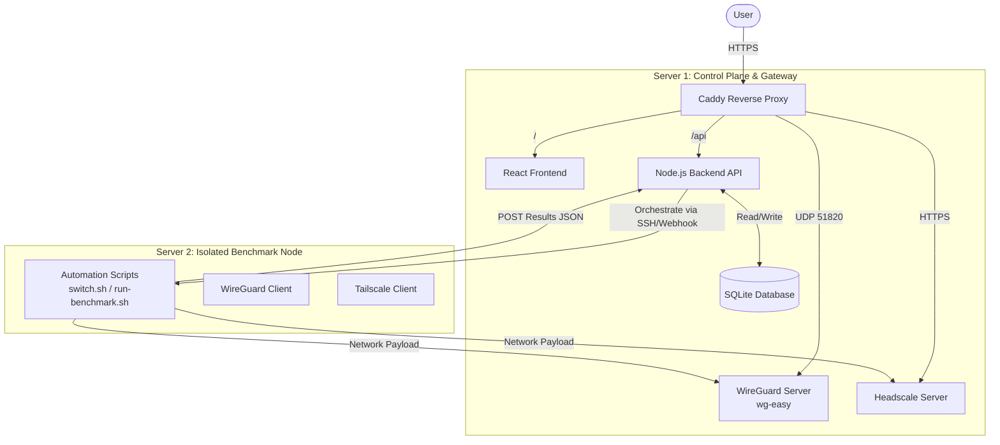
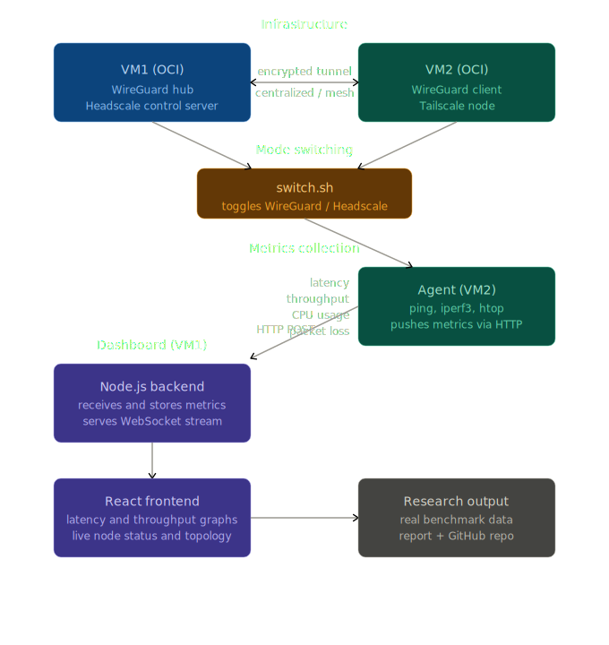
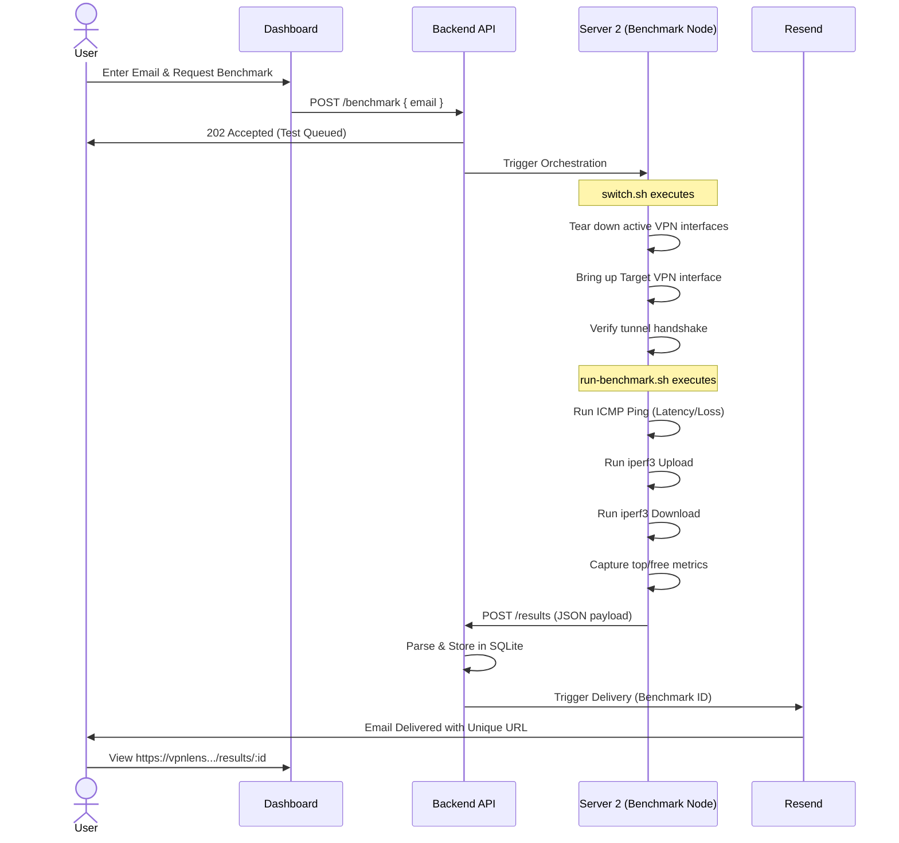

#  VPNLens

> An end-to-end automated benchmarking platform for evaluating open-source VPN architectures on real cloud infrastructure.

VPNLens began as a university internship project to compare the performance characteristics of WireGuard and Headscale. During development, the scope expanded significantly. Rather than manually provisioning tunnels and recording `iperf3` outputs into spreadsheets, VPNLens evolved into a complete benchmarking infrastructure.

The core philosophy of this project is deterministic automation: **eliminate manual intervention from the benchmarking lifecycle.** VPNLens handles VPN deployment, lifecycle management, network traffic generation, metric collection, and result distribution through a fully reproducible workflow.

---


#  Architecture

To ensure the integrity of the performance metrics, VPNLens utilizes a strict two-server architecture deployed on Oracle Cloud Infrastructure (OCI).





### Server 1: The Control Plane

Server 1 acts as the management and orchestration hub. It hosts the infrastructure required to serve the platform and manage the VPN connections, but it does *not* execute the benchmarks.

* **Domains & Routing:** Managed by Caddy.
* Frontend: `[https://vpnlens.samay15jan.com](https://vpnlens.samay15jan.com)`
* Backend API: `[https://backend.vpnlens.samay15jan.com](https://backend.vpnlens.samay15jan.com)`
* WireGuard Endpoint: `[https://wg.vpnlens.samay15jan.com](https://wg.vpnlens.samay15jan.com)`
* Headscale Control: `[https://hs.vpnlens.samay15jan.com](https://hs.vpnlens.samay15jan.com)`
* Docs: `[https://docs.vpnlens.samay15jan.com](https://docs.vpnlens.samay15jan.com)`


* **Workloads:** React frontend, Node.js backend, SQLite database, WireGuard server (via `wg-easy`), and the Headscale control server.

### Server 2: The Benchmark Node

Server 2 is entirely dedicated to generating and measuring network traffic.

* **Isolation:** This server never hosts the dashboard, API, or database.
* **Workloads:** WireGuard client, Tailscale client (connecting to Headscale), and bash automation scripts (`switch.sh`, `run-benchmark.sh`).
* **Purpose:** By isolating the load generation, we ensure that CPU spikes from the Node.js backend processing a request, or the React frontend serving assets, do not introduce latency jitter or throttle the `iperf3` throughput measurements.

---

#  Features

* **Automated Lifecycle Management:** Programmatic toggling of VPN interfaces via custom bash orchestration (`switch.sh`), ensuring clean state before every test.
* **Deterministic Network Benchmarking:** Automated execution of `iperf3` and ICMP probes to measure throughput, latency, and packet loss without human error.
* **Resource Utilization Tracking:** Real-time collection of CPU and Memory consumption during active payload transmission to evaluate the overhead of the VPN protocols.
* **Asynchronous Result Delivery:** Offloading long-running benchmark sessions to a background process and notifying users via Resend email integration upon completion.
* **Immutable Result URLs:** Generation of unique, shareable, and permanent links for specific benchmark runs.
* **Infrastructure as Code (partial):** Containerized deployments utilizing Docker and Docker Compose for reproducible environment setups.
* **Continuous Deployment:** Automated CI/CD pipelines via GitHub Actions for building and deploying backend and frontend updates.

---

# Technology Stack

| Domain | Technology | Description |
| --- | --- | --- |
| **Frontend** | React, Vite | SPA architecture for the dashboard and result visualization. |
| **Backend** | Node.js, Express | RESTful API orchestrating the benchmarking state machine. |
| **Database** | SQLite | Lightweight, file-based relational data storage. |
| **Infrastructure** | Docker, Docker Compose | Complete containerization of all services. |
| **Proxy / TLS** | Caddy | Reverse proxy with automatic Let's Encrypt TLS provisioning. |
| **Cloud Provider** | Oracle Cloud (OCI) | Compute instances hosting the Control Plane and Benchmark Node. |
| **VPN Solutions** | WireGuard, Headscale | The target architectures under evaluation. |
| **Mailing** | Resend | Transactional email API for asynchronous user notification. |
| **CI/CD** | GitHub Actions | Automated build, test, and deployment pipelines. |

---

#  Benchmark Workflow

The execution of a benchmark follows a strict, sequential pipeline to ensure data validity.



---

# 📊 Metrics Collected

VPNLens collects raw metrics directly from the operating system and networking utilities.

| Metric Category | Specific Data Points | Tool / Method |
| --- | --- | --- |
| **Latency** | Minimum, Average, Maximum | `ping` (ICMP) |
| **Reliability** | Packet Loss Percentage | `ping` (ICMP) |
| **Throughput** | Upload (Mbps), Download (Mbps) | `iperf3` (TCP/UDP) |
| **Compute Overhead** | Average CPU, Peak CPU | `top` / `ps` during `iperf3` |
| **Memory Footprint** | Average Memory, Peak Memory | `free` / `ps` during `iperf3` |
| **Lifecycle** | Connection Establishment Time, Recovery Time | Scripted timing wrappers |

---

#  Important Design Decisions

This project avoids "default" choices in favor of deliberate architectural decisions tailored for accurate benchmarking.

### The Two-Server Architecture

> [!IMPORTANT]
> Benchmarking network performance requires pristine compute environments.

If the Node.js backend and the `iperf3` client run on the same machine, garbage collection pauses or database writes from the web app will consume CPU cycles. Network throughput (especially in kernel-space VPNs like WireGuard) is highly CPU-bound. The Control Plane (Server 1) handles the noise of web traffic; the Benchmark Node (Server 2) remains idle until a test begins, ensuring measurements reflect the VPN's performance, not the server's background load.

### SQLite Over PostgreSQL

While PostgreSQL is the industry standard for production web apps, VPNLens is a read-heavy, low-concurrent-write application. Benchmarks run sequentially, meaning database writes happen periodically and linearly. SQLite's file-based architecture eliminates the need for a separate database container, reduces RAM footprint on Server 1, and simplifies backups without sacrificing relational data integrity.

### Docker Everywhere

Every component—from the frontend to `wg-easy` and Headscale—is containerized. This prevents dependency drift (e.g., mismatched Node.js versions or conflicting kernel headers). It also ensures that the Control Plane can be torn down and rebuilt deterministically.

### Caddy Instead of Nginx

Managing multiple subdomains (`vpnlens`, `backend`, `wg`, `hs`) requires SSL/TLS certificates. Nginx typically requires secondary services like `certbot` and cron jobs to manage Let's Encrypt renewals. Caddy was chosen because HTTPS is automatic and default. The `Caddyfile` is a fraction of the size of an equivalent `nginx.conf`, reducing configuration complexity.

### Asynchronous Email Notifications

Running a comprehensive network benchmark (multiple `iperf3` streams, latency checks, connection state toggling) takes several minutes. Keeping an HTTP request open for this duration risks browser timeouts, reverse proxy timeouts, or dropped connections on mobile devices. By accepting the request, queuing the job, and sending the unique result URL via Resend, the system design aligns with asynchronous job processing best practices.

### Sequential Testing (No Parallelization)

VPNLens explicitly queues benchmark requests and runs them one at a time. If two users request a benchmark simultaneously, running them in parallel would split the underlying network interface card (NIC) bandwidth and CPU time, rendering both sets of results invalid. Queueing ensures 100% of Server 2's resources are available for every individual test.

### Differentiating VPN Recovery Mechanisms

A key design challenge was normalizing the measurement of "Recovery Time." WireGuard is fundamentally stateless; it does not "connect" in the traditional sense, it simply routes packets if the cryptographic keypair matches. Headscale (Tailscale) utilizes a coordination server and a stateful control plane. The benchmarking scripts must account for this architectural difference. We measure WireGuard's recovery by the time it takes for a packet to route after an interface reset, whereas Headscale's recovery includes the control plane handshake. This is documented not as an inconsistency in our benchmarking, but as a fundamental architectural characteristic of the protocols being tested.

---

#  Repository Structure

```text
.
├── backend/            # Node.js REST API source code
├── configs/            # Global configuration files (Caddyfile, Docker Compose)
├── docs/               # Markdown documentation and architectural diagrams
├── src/                # React frontend source code
├── public/             # Static assets for the frontend
└── scripts/            # Bash orchestration (switch.sh, run-benchmark.sh)

```

* **`backend/`**: Contains the Express application, SQLite schema definitions, Resend email templates, and the job queue logic.
* **`configs/`**: The source of truth for infrastructure. Contains the `Caddyfile` for routing and `docker-compose.yml` files for spinning up the Control Plane.
* **`docs/`**: Project documentation, linking out to WPRs and architectural deep dives.
* **`src/` & `public/**`: The Vite/React web application.
* **`scripts/`**: The core execution engine located on Server 2. These scripts manage the Linux networking stack (bringing `wg0` and `tailscale0` up/down) and pipe system output into JSON payloads for the backend.

---

#  Screenshots

> [!NOTE]
> *Image placeholders for the completed UI.*

* **[Placeholder: Dashboard Landing Page]**
* **[Placeholder: Real-time Benchmark Execution Status]**
* **[Placeholder: Detailed Benchmark Results & Charts]**
* **[Placeholder: Automated Email Delivery via Resend]**
* **[Placeholder: OCI Infrastructure Network Topology]**

---

#  Roadmap

### Current / Completed

* [x] Base university project (WireGuard vs Headscale comparison).
* [x] Two-server isolation architecture.
* [x] Automated metric gathering (`run-benchmark.sh`).
* [x] Full-stack application deployment via Docker.
* [x] Asynchronous email notifications.
* [x] CI/CD pipeline via GitHub Actions.

### Future Expansion

* [ ] **Terraform Integration:** Fully codify the OCI infrastructure provisioning to allow one-click cluster creation.
* [ ] **Ansible Configuration:** Replace manual setup of Server 2 with Ansible playbooks for dependency installation (`iperf3`, WireGuard, Tailscale).
* [ ] **Destroyable Infrastructure:** Ephemeral benchmark nodes that spin up, run tests, and tear down to save cloud costs.
* [ ] **Protocol Expansion:** Add support for OpenVPN, IPSec (StrongSwan), and Nebula.
* [ ] **Historical Analytics:** Aggregate data over time to visualize network degradation or improvements across different cloud regions.
* [ ] **Multi-Cloud Benchmarking:** Deploy Server 2 nodes in AWS and GCP to test cross-cloud VPN performance.

---

#  Documentation

Detailed documentation regarding specific implementation steps will be added to the `docs/` directory:

* [Introduction](https://www.google.com/search?q=./docs/introduction.md)
* [Architecture Details](https://www.google.com/search?q=./docs/architecture.md)
* [Infrastructure Setup](https://www.google.com/search?q=./docs/infrastructure.md)
* [Deployment Guide](https://www.google.com/search?q=./docs/deployment.md)
* [API Reference](https://www.google.com/search?q=./docs/api.md)
* [Benchmarking Methodology](https://www.google.com/search?q=./docs/benchmarking.md)
* [Script Internals](https://www.google.com/search?q=./docs/scripts.md)
* [Engineering Challenges](https://www.google.com/search?q=./docs/challenges.md)
* [Development History](https://www.google.com/search?q=./docs/history.md)

---

#  Academic Resources

This platform originated as an academic requirement. The following resources document the theoretical research, weekly progress, and final project defense.

* [Project Synopsis](https://www.google.com/search?q=./docs/academic/synopsis.pdf)
* [Weekly Progress Report 1 (WPR 1)](/docs/academic/wpr1.jpg)
* [Weekly Progress Report 2 (WPR 2)](https://www.google.com/search?q=./docs/academic/wpr2.pdf)
* [Weekly Progress Report 3 (WPR 3)](https://www.google.com/search?q=./docs/academic/wpr3.pdf)
* [Weekly Progress Report 4 (WPR 4)](https://www.google.com/search?q=./docs/academic/wpr4.pdf)
* [Weekly Progress Report 5 (WPR 5)](https://www.google.com/search?q=./docs/academic/wpr5.pdf)
* [Final Project Report](https://www.google.com/search?q=./docs/academic/final_report.pdf)

#  Quick Start (Local Development)

> [!NOTE]
> These instructions are for spinning up a local development environment. For production deployment on Oracle Cloud Infrastructure, refer to the [Deployment Guide](https://www.google.com/search?q=./docs/deployment.md).

Because the entire stack is containerized, local orchestration requires only Docker and Docker Compose.

### Prerequisites

* Docker Engine (v24.0+)
* Docker Compose (v2.20+)
* Node.js (v20 LTS) - *Optional, for running outside containers*

### 1. Clone the Repository

```bash
git clone https://github.com/samay15jan/vpnlens.git
cd vpnlens

```

### 2. Configure Environment Variables & Copy SSH keys
 
Copy the example environment files for both the frontend and backend.

```bash
cp backend/.env.example backend/.env
cp src/.env.example src/.env
cp /PATH/TO/SECOND/SERVER/SSH/KEY.key keys/server2.key 
sudo chmod 600 keys/server2.key 

```

Ensure you add your `RESEND_API_KEY` in the `backend/.env` file to enable email notifications during local testing.

### 3. Initialize the Stack

Use the local development compose file to spin up the React frontend, Node.js backend, and SQLite volume.

```bash
docker compose -f configs/docker-compose.local.yml up -d --build

```

The application will be accessible at:

* **Dashboard:** `http://localhost:5173`
* **API:** `http://localhost:3000`

---

#  Contributing

VPNLens is an evolving open-source platform. Contributions from Platform Engineers, Cloud Architects, and DevOps enthusiasts are highly encouraged.

### How to Contribute

1. **Fork the Repository:** Create your own branch (`feature/add-ipsec-support` or `fix/iperf3-timeout`).
2. **Test Locally:** Ensure that your changes do not break the strict separation between the Control Plane and the Benchmark Node.
3. **Submit a Pull Request:** Provide a detailed description of the architectural changes or script modifications.

Please read our [Contributing Guidelines](https://www.google.com/search?q=./CONTRIBUTING.md) and our [Code of Conduct](https://www.google.com/search?q=./CODE_OF_CONDUCT.md) before submitting pull requests.

---

#  Security

If you discover a security vulnerability within VPNLens (particularly related to how the bash scripts execute or how `wg-keys` are handled in memory), please DO NOT open a public issue.

Instead, send an email directly to the project maintainers. We treat infrastructure security with the highest priority and will issue a patch before public disclosure.

---

#  License

This project is licensed under the **MIT License**.

You are free to use, modify, and distribute this software in both academic and commercial settings, provided that the original copyright notice is included. See the [LICENSE](https://www.google.com/search?q=./LICENSE) file for full details.