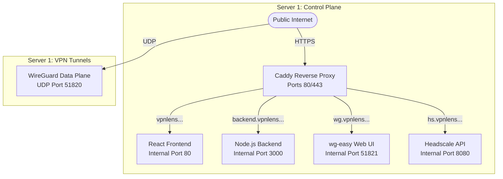

# VPNLens: Infrastructure

## Objective

The purpose of this document is to detail the underlying infrastructure that powers the VPNLens platform. It is designed to provide DevOps Engineers, Platform Engineers, and open-source contributors with a comprehensive understanding of how VPNLens is deployed in the cloud and how its various infrastructure components interact.

This document is not a step-by-step deployment guide. Instead, it is an engineering design document that answers fundamental architectural questions: Why was Oracle Cloud selected? Why rely on Docker and Docker Compose? Why use Caddy over Nginx? Why is the infrastructure physically split across two servers? How do the services communicate securely, and how is the entire platform made reproducible?

By the end of this document, the reader will understand the operational workflow, the deployment strategy, and the strict engineering trade-offs made to guarantee accurate, isolated network benchmarking.

---

## Infrastructure Philosophy

The infrastructure of VPNLens is not merely a hosting environment; it is a core component of the benchmarking methodology itself. The platform was designed from the ground up adhering to the following strict philosophies:

* **Reproducibility over Convenience:** A benchmark is useless if the environment it runs in cannot be perfectly replicated. The infrastructure must be defined in a way that allows another engineer to deploy the exact same stack and verify the results.
* **Containerization by Default:** To avoid "dependency hell," kernel header mismatches, and software version drift, every user-space component of VPNLens operates within a containerized environment.
* **Lightweight and Self-Hosted:** The platform must not rely on expensive enterprise managed services (like managed Kubernetes clusters or managed PostgreSQL databases) that would prohibit students, researchers, or open-source self-hosters from utilizing the tool.
* **Infrastructure-First Mentality:** During the evolution of the project, it became apparent that inaccurate benchmarking was a symptom of poor infrastructure design (e.g., resource contention on a single machine). Consequently, designing the infrastructure for isolation became as important as writing the benchmarking scripts themselves.
* **Easy to Rebuild:** The system treats the control plane as disposable. Through containerization and volume mounts, the entire control plane can be destroyed and rebuilt in minutes without data loss.

---

## Cloud Environment

VPNLens is currently deployed on Oracle Cloud Infrastructure (OCI). While the containerized nature of the platform makes it cloud-agnostic (capable of running on AWS, GCP, or bare metal), OCI was selected as the foundational environment for specific engineering and economic reasons.

### Why Oracle Cloud Infrastructure (OCI)?

Originally starting as a university internship project, cost-efficiency and resource availability were critical. OCI provides a highly capable "Always Free" tier, offering robust ARM-based Ampere compute instances with significant RAM and network bandwidth allocations. This allowed the project to scale from a local test environment to a fully public, real-world cloud deployment without incurring prohibitive operational costs. OCI's virtual cloud networks (VCNs) also offer granular control over subnet routing and security lists, which is essential when testing custom VPN tunnels.

### Virtual Machine Setup

The infrastructure consists of distinct Virtual Machines (VMs) running Ubuntu LTS. Ubuntu was selected due to its ubiquitous support for Docker, modern kernel versions (crucial for native WireGuard support), and extensive community documentation.

* **Public Routing:** Both instances are assigned static Public IP addresses, allowing them to communicate over the public internet, which is necessary for evaluating real-world VPN tunnel traversal and latency.
* **Firewall and Networking:** OCI Security Lists and Ubuntu's `ufw` (Uncomplicated Firewall) are strictly configured. Only essential ports are exposed: TCP 80/443 for web traffic, TCP 22 for internal SSH orchestration, UDP 51820 for WireGuard, and specific ports for the Headscale control plane.

### Benefits and Limitations

* **Benefits:** High bandwidth availability, cost-effective scaling, and robust network security group configurations.
* **Limitations:** By tying the initial deployment to OCI's specific firewall logic, migrating to a different provider requires translating OCI Security Lists into AWS Security Groups or GCP Firewall Rules. Future Infrastructure-as-Code (IaC) integration will abstract this limitation.

---

## Server Topology

To guarantee that benchmark metrics are mathematically valid and uncorrupted by background processes, VPNLens utilizes a strict two-server topology.

### Server 1: The Control Plane

This node acts as the brain of the platform. It handles all state management, user interaction, and VPN coordination.

**Responsibilities:**

* **Frontend:** Serving the compiled React SPA.
* **Backend:** Running the Node.js API and job orchestration queue.
* **Database:** Hosting the SQLite database for persistence.
* **Reverse Proxy:** Caddy handles TLS termination and subdomain routing.
* **WireGuard Server:** Hosts the `wg-easy` container for the WireGuard baseline.
* **Headscale Server:** Hosts the Tailscale-compatible open-source control plane.

### Server 2: The Benchmark Node

This node is the dedicated execution environment. It never hosts the dashboard, the API, or the database.

**Responsibilities:**

* **VPN Clients:** Hosts the WireGuard CLI and Tailscale CLI.
* **Orchestration Scripts:** Executes `switch.sh` (for network state management) and `run-benchmark.sh` (for load generation).

### Why Benchmark Execution is Isolated

If the backend API processes a webhook or the React frontend serves a JavaScript bundle while an `iperf3` test is actively running on the same machine, CPU interrupts will occur. Because network routing—especially cryptographic encapsulation—is highly CPU-bound, these interrupts introduce latency jitter and throttle throughput. By completely isolating Server 2, its compute resources sit at a near-zero utilization baseline until the exact moment a benchmark begins, ensuring 100% of the CPU and NIC capacity is dedicated to evaluating the VPN protocol.

---

## Network Architecture

VPNLens relies on a structured Domain Name System (DNS) configuration to route external traffic to the correct internal containers on Server 1.

### Domain Routing Strategy

The platform utilizes specific subdomains under a primary apex domain to separate concerns logically and cleanly.

* **Frontend:** `vpnlens.samay15jan.com` — Routes to the static file server hosting the React application.
* **Backend:** `backend.vpnlens.samay15jan.com` — Routes to the Node.js Express API.
* **WireGuard:** `wg.vpnlens.samay15jan.com` — Routes to the `wg-easy` web administration interface.
* **Headscale:** `hs.vpnlens.samay15jan.com` — Routes to the Headscale control plane API.

### Reverse Proxy and TLS

Caddy acts as the edge gateway for Server 1. All incoming traffic on ports 80 and 443 hits Caddy first. Caddy automatically provisions and renews SSL/TLS certificates via Let's Encrypt using the ACME protocol. It then securely proxies the decrypted traffic to the internal Docker network ports.

---

## Docker Strategy

VPNLens is a highly containerized application. Rather than installing Node.js, SQLite, Caddy, and VPN servers directly onto the host operating system, everything runs inside Docker containers.

### Why Containers?

* **Isolation:** Each component runs in its own namespace. The backend cannot accidentally conflict with the frontend's dependencies. Furthermore, Docker's network isolation prevents internal services from being exposed to the public internet unless explicitly routed through Caddy.
* **Consistency:** A container image built on a developer's laptop will behave identically on the OCI production server. This eliminates the "it works on my machine" anti-pattern.
* **Simple Deployment:** Managing the lifecycle of the application is reduced to standard Docker commands, avoiding complex systemd service files and manual bash installation scripts.
* **Reproducibility:** The `Dockerfile` and `docker-compose.yml` serve as executable documentation. The exact state of the infrastructure is committed to version control.

### Docker Compose and Service Separation

Docker Compose is used to orchestrate the multi-container environment on Server 1. The `docker-compose.yml` file defines the relationships, internal networking, and persistent volume mounts for the backend, frontend, database, Caddy, and VPN services. This separation allows individual services (e.g., the backend API) to be restarted or updated without disrupting the routing of the Headscale control plane.

---

## Reverse Proxy: Why Caddy?

In modern web infrastructure, Nginx is often the default choice for reverse proxying. However, VPNLens specifically utilizes Caddy.

### Engineering Trade-offs: Caddy vs. Nginx

* **Automatic HTTPS:** Caddy is built with HTTPS by default. It automatically handles the Let's Encrypt ACME challenges, provisions certificates, and manages renewals without requiring external tools like `certbot` or cron jobs.
* **Simple Configuration:** The `Caddyfile` syntax is incredibly concise. Routing four subdomains to four different internal Docker ports takes roughly ten lines of configuration. Achieving the same in Nginx requires complex server blocks, SSL configuration lines, and explicit cipher suite definitions.
* **Modern Defaults:** Caddy automatically configures modern TLS standards and HTTP/2 (and HTTP/3) support out of the box, reducing the operational burden on the infrastructure engineer.

For a project focused on operational simplicity and minimizing infrastructure maintenance overhead, Caddy's automated certificate lifecycle management makes it vastly superior to Nginx.

---

## GitHub Actions

To maintain the principles of reproducibility and automation, VPNLens utilizes GitHub Actions for Continuous Integration and Continuous Deployment (CI/CD).

### Container Automation

When code is pushed to the main branch, GitHub Actions automatically triggers a build pipeline.

* **Docker Image Builds:** The workflows compile the React frontend and package the Node.js backend into immutable Docker images.
* **Automatic Image Publishing:** These images are pushed to a container registry.

### Why Container Automation Matters

By automating the build process, we remove the human element from the deployment pipeline. Engineers do not need to manually pull code onto the production server and run `npm install`. Instead, they simply instruct Server 1 to pull the latest pre-compiled, tested Docker image, ensuring zero-downtime updates and preventing build-time resource consumption on the production servers.

---

## Email Infrastructure

Network benchmarking is fundamentally a long-running, asynchronous process. A comprehensive evaluation of latency, throughput, and CPU overhead across multiple VPN protocols takes several minutes.

### Why Email Notifications?

If the dashboard relied on standard synchronous HTTP requests, the user would be forced to keep their browser tab open and active for the duration of the test. This frequently leads to reverse proxy timeouts, browser disconnects, or dropped mobile connections, resulting in lost data.

To solve this, VPNLens integrates with Resend to provide asynchronous email notifications.

### User Workflow

1. The user requests a benchmark via the frontend, providing their email address.
2. The backend accepts the request, queues the job, and immediately returns a success response to the UI.
3. The benchmark executes in the background on Server 2.
4. Upon completion, the backend dynamically generates an email containing a unique, permanent URL to the benchmark report and utilizes the Resend API to deliver it to the user.

This infrastructure choice decouples the user's session state from the execution state of the infrastructure.

---

## Data Storage

VPNLens relies on SQLite for its relational data storage needs.

### Why SQLite instead of PostgreSQL

In enterprise applications, PostgreSQL is the standard for handling high-concurrency, distributed writes. However, VPNLens is a benchmarking orchestration platform, not a high-traffic social network.

* **Current Scale:** The system intentionally enforces sequential job execution (only one benchmark runs at a time). Therefore, database writes occur linearly, not concurrently.
* **Benefits:** SQLite operates as a single file on disk, requiring no separate database server process, no complex user authentication schemas, and minimal RAM. Backing up the database is as simple as copying the `.sqlite` file. It keeps the infrastructure footprint incredibly lightweight.
* **Trade-offs:** If the platform were to scale to support parallel benchmarking across dozens of Server 2 nodes simultaneously, SQLite would encounter write-lock contention.
* **Future Migration:** If the project evolves to require distributed state management, the Node.js backend utilizes an ORM (Object-Relational Mapper) that allows for a relatively painless migration to PostgreSQL by simply altering the connection string and driver.

---

## Security

Security is integrated into the infrastructure at multiple layers, adhering to the principle of least privilege.

* **HTTPS Only:** All external communication to the Control Plane is encrypted via TLS 1.3, enforced by Caddy.
* **SSH Key Authentication:** Server 1 (Backend) orchestrates Server 2 (Benchmark Node) using strictly ED25519/RSA SSH key pairs. Password authentication on Server 2 is entirely disabled at the OS level.
* **Email Validation:** Results are tied to specific email addresses, preventing enumeration of benchmark data.
* **Unique Benchmark Tokens:** Benchmark reports are accessed via cryptographically secure, random UUIDv4 hashes rather than sequential integer IDs (e.g., `/results/123`), preventing malicious scraping of historical data.

### Future Improvements

Current security assumptions trust the internal Docker bridge network. Future infrastructure iterations will implement strict network namespaces and internal firewalls to ensure that the React container cannot communicate directly with the Headscale container, further isolating potential attack vectors.

---

## Future Infrastructure

While the current Docker Compose and bash orchestration model is robust, the roadmap for VPNLens involves advancing toward complete Infrastructure as Code (IaC).

* **Terraform:** Future iterations will define the OCI Virtual Cloud Networks, Subnets, and Compute Instances as Terraform state files. This will allow the entire cloud environment to be provisioned, audited, and destroyed with a single command.
* **Ansible:** The manual installation of dependencies (WireGuard, Tailscale, `iperf3`) on Server 2 will be replaced by idempotent Ansible playbooks, guaranteeing exact configuration states.
* **Destroyable Infrastructure:** With Terraform and Ansible, Server 2 can become an ephemeral node. The backend will spin up Server 2 on demand, run the benchmark, and instantly destroy the VM, significantly reducing cloud costs and ensuring an absolutely pristine kernel state for every test.
* **Multi-Region Benchmarking:** Transitioning to IaC will allow the effortless deployment of Benchmark Nodes across multiple cloud providers (AWS, GCP, Azure) to evaluate inter-cloud VPN performance and regional latency degradation.

---

## Infrastructure Lessons Learned

The development of VPNLens yielded several critical engineering insights:

* **Containerization is Mandatory:** Attempting to run `wg-easy`, Headscale, and Node.js on the same bare-metal host inevitably leads to port conflicts and routing table pollution. Docker namespaces are essential for complex networking applications.
* **Networking Abstractions Leak:** While Docker makes deployment easy, understanding the underlying Linux networking stack (iptables, NAT, bridging) is required to troubleshoot why a containerized VPN cannot route packets to the host interface.
* **Operational Simplicity Wins:** Choosing Caddy over Nginx, and SQLite over PostgreSQL, saved weeks of configuration management and troubleshooting, allowing engineering effort to remain focused on the core benchmarking logic.
* **Trade-offs are Inevitable:** We traded the ability to run multiple tests concurrently for the guarantee of absolute data accuracy by isolating Server 2. In infrastructure design, guaranteeing isolation often requires sacrificing parallel throughput.

---

## Conclusion

The infrastructure of VPNLens is a deliberate, engineered solution designed to solve the physical constraints of network benchmarking. By embracing containerization, decoupling execution states via asynchronous notifications, and strictly isolating compute resources across two distinct servers, the platform achieves its primary goal: delivering highly accurate, reproducible data.

With the architectural theory and infrastructure topology established, the next phase is to understand the practical steps required to bring this system online.

Please proceed to the Deployment documentation.