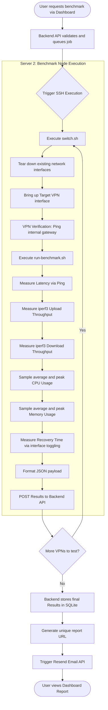

# VPNLens: Benchmarking

## Introduction

Benchmarking is the functional core of the VPNLens platform. While deploying and managing virtual private networks is a necessary prerequisite, the primary objective of this project is to measure, record, and analyze their performance.

The goal of VPNLens is not simply measuring absolute speed. Raw throughput numbers are heavily dependent on the specific compute instance and network interface card (NIC) provided by the cloud host. Instead, the goal is creating **reproducible, deterministic, and comparable benchmark results**. A benchmark that cannot be perfectly reproduced by another engineer under identical conditions is scientifically invalid.

Automation is paramount to this objective. Manual benchmarking—where an engineer connects to a server, types `iperf3` commands, and copies the results into a spreadsheet—introduces unacceptable levels of human error, observer interference, and environmental inconsistency. VPNLens exists to entirely abstract the human element from the measurement lifecycle, executing rigorous network tests programmatically.

---

## Benchmark Philosophy

The design of the VPNLens benchmarking engine is governed by a strict set of engineering philosophies:

* **Repeatability:** The platform must guarantee that a benchmark executed today will perform the exact same operational sequence as a benchmark executed a year from now.
* **Automation:** Human interaction must end at the dashboard. All state changes, metric sampling, payload generation, and data aggregation must be handled by bash scripts and backend job queues.
* **Fairness:** No VPN protocol should be given a systemic advantage. Both protocols must be tested using the exact same underlying hardware, the same operating system kernel, and the same payload generation tools.
* **Isolation:** The act of measuring a system alters the system (the Observer Effect). If the backend API processes a web request while a network test is running, CPU interrupts will skew the throughput metrics. Therefore, benchmarking must be physically isolated from the control plane.
* **Consistency:** Background noise must be minimized. The benchmark node must run a minimal Linux footprint with identical starting conditions before every single protocol evaluation.
* **Real Cloud Infrastructure:** Synthetic local-machine tests (e.g., benchmarking Docker containers on a single laptop) do not reflect reality. Benchmarks must occur over public Internet routing using actual cloud compute instances.
* **Sequential Execution:** Parallel testing is strictly prohibited. If two network tests run simultaneously, they will compete for NIC bandwidth and CPU scheduling, invalidating both results. Benchmarks are strictly queued and executed sequentially.

Executing benchmarks under identical conditions ensures that the delta in performance metrics is exclusively attributable to the architectural differences of the VPN protocols, rather than environmental noise.

---

## Test Environment

The physical and virtual environment where the benchmarks occur is strictly defined to ensure standardization.

### Cloud Provider and Hardware

VPNLens operates on Oracle Cloud Infrastructure (OCI). The environment utilizes identical Ampere (ARM-based) compute instances for both the Control Plane (Server 1) and the Benchmark Node (Server 2). Identical hardware profiles ensure that the baseline CPU cache, memory bandwidth, and NIC offloading capabilities remain constant across the infrastructure.

### Operating System and Kernel

Both servers run Ubuntu LTS. Ubuntu was selected because its modern Linux kernel natively includes the `wireguard-linux` module. This is critical: if WireGuard were forced to run via a userspace implementation (like `wireguard-go`) due to an outdated kernel, it would invalidate the comparison against Headscale's userspace architecture.

### Containerization

The Control Plane is fully containerized using Docker. This ensures that the VPN servers (the targets of the benchmark) operate in predictable, isolated network namespaces.

### The Dedicated Benchmark Node (Server 2)

The most critical environmental decision in VPNLens is the physical isolation of the benchmark execution. Server 2 never hosts the React dashboard, the Node.js backend, or the SQLite database. It acts as a pristine, dedicated client.

**Why a separate node was chosen:**
Network encapsulation (especially cryptographic routing) is highly bound to CPU performance. If the benchmarking scripts ran on the Control Plane, random background tasks—such as the Node.js garbage collector running, or a user refreshing the dashboard—would consume CPU cycles. This resource contention would artificially throttle the VPN's throughput. By dedicating Server 2 exclusively to benchmarking, we guarantee that 100% of the compute resources are available to the VPN interface during a test.

---

## Benchmark Lifecycle

The benchmark lifecycle is a strict, programmatic state machine orchestrated by the backend and executed by Server 2.

### Stage Explanations

1. **Request & Queue:** The user initiates the test. The backend places it in a FIFO queue to prevent concurrent executions.
2. **SSH Orchestration:** The backend connects to Server 2 via SSH to trigger the state machine.
3. **switch.sh:** The node ensures a clean slate, removing old IP tables and bringing up the requested VPN tunnel.
4. **Verification:** Before running `iperf3`, the script explicitly verifies that the cryptographic handshake succeeded and packets are routing correctly.
5. **run-benchmark.sh:** The core payload generator runs the predefined sequence of network stress tests.
6. **POST:** The script uses `curl` to asynchronously deliver the gathered metrics back to the backend, closing the execution loop.
7. **Email & Dashboard:** The user is notified asynchronously, preventing them from needing to maintain an open HTTP connection for the duration of the test.

---

## Benchmark Metrics

VPNLens captures a holistic suite of metrics, moving beyond raw speed to measure reliability, efficiency, and lifecycle timing.

### Latency (Minimum, Average, Maximum)

Latency is measured using ICMP echo requests (`ping`).

* **Why it matters:** Throughput dictates how *much* data can be sent, but latency dictates how *fast* the connection feels. High latency severely impacts interactive applications (SSH, RDP, VoIP). By capturing the Min, Avg, and Max, VPNLens can identify latency jitter—which often indicates CPU bottlenecking during cryptographic encapsulation.

### Packet Loss

Measured alongside latency via ICMP sequence tracking.

* **Why it matters:** A VPN tunnel must be reliable. High packet loss forces TCP to continuously retransmit data, which exponentially degrades perceived throughput. Packet loss often indicates UDP fragmentation issues or MTU (Maximum Transmission Unit) mismatches within the tunnel.

### Throughput (Upload and Download)

Measured using `iperf3`, the industry standard for active TCP/UDP bandwidth measurement.

* **Methodology:** VPNLens forces a standard TCP payload stream for a fixed duration. Upload tests measure data flowing from Server 2 to Server 1. Download tests utilize the `iperf3 -R` (reverse) flag to pull data from Server 1 to Server 2.

### CPU Usage (Average and Peak)

Measured by sampling `/proc/stat` and `top -b -n 1` specifically during the active `iperf3` transfer window.

* **Methodology:** The benchmarking script captures CPU utilization percentages while the tunnel is under maximum load.
* **Why it matters:** Cryptography is expensive. A VPN that achieves 1 Gbps but consumes 100% of the CPU is often less desirable in a microservices environment than a VPN that achieves 800 Mbps but only consumes 20% of the CPU.

### Memory Usage (Average and Peak)

Measured by sampling `free -m` during active payload transfer.

* **Why it matters:** Userspace applications (like Headscale's `wireguard-go` implementation) typically require garbage collection and larger memory buffers compared to kernel-space modules. Measuring this footprint is critical for deploying VPNs on constrained edge devices.

### Connection Establishment Time

Measured by timing the execution of the interface initialization commands within `switch.sh`.

* **Why it matters:** In ephemeral cloud environments where nodes scale up and down dynamically, the time it takes for a node to join the overlay network and begin routing traffic is a critical operational metric.

### Recovery Time

Measured by intentionally dropping the active VPN interface, bringing it back up, and timing the exact millisecond duration until the first successful ICMP echo reply is received.

* **Why it exists:** Tunnels break. Networks roam (e.g., a mobile device switching from Wi-Fi to Cellular). Measuring how fast a protocol recovers from a disruption is crucial for high-availability infrastructure.

#### The Architectural Divide in Recovery Benchmarking

WireGuard and Headscale are benchmarked differently during the Recovery phase. **This difference is an architectural characteristic rather than a flaw in the benchmarking methodology.**

* **WireGuard (Stateless):** WireGuard utilizes Cryptokey Routing. It is fundamentally stateless. There is no active "session" or coordination server. If the interface goes down and comes back up, it simply begins encrypting and firing UDP packets at the endpoint. Recovery is nearly instantaneous because there is no handshake to negotiate.
* **Headscale (Stateful Control Plane):** Headscale relies on a central coordination server. When the interface drops, the Tailscale client must often re-authenticate, query the Headscale server for updated peer routing tables, negotiate NAT traversal (STUN/TURN), and *then* establish the data plane.

Because Headscale requires control plane negotiation to recover, the benchmarking script must allow for this architectural reality. We do not penalize Headscale for this; we simply record the time required for its stateful recovery model to complete its designed operational flow.

---

## Benchmark Automation

To ensure modularity and maintainability, the execution logic on Server 2 is strictly bifurcated into two distinct bash scripts.

### `switch.sh`

**Responsibility:** Network state management.
This script *only* switches the VPN. It ensures that if WireGuard is currently active, it is completely torn down (`wg-quick down`) before Headscale is initialized. It flushes IP tables, resets routing rules, and confirms the tunnel is active.

### `run-benchmark.sh`

**Responsibility:** Load generation and metric collection.
This script *only* benchmarks. It assumes the network interface is already correctly configured and routing. It executes the `iperf3`, `ping`, and resource sampling commands, formatting the final output into JSON.

**Why this separation improves maintainability:**
By decoupling state management from measurement, the system becomes highly extensible. If a new VPN protocol (e.g., OpenVPN) is added to VPNLens, engineers only need to update `switch.sh` to handle the OpenVPN startup sequence. The `run-benchmark.sh` script requires zero modifications, as it blindly tests whatever tunnel is currently active.

---

## Benchmark Fairness

Ensuring fairness between completely different protocols requires ruthless standardization of the execution environment.

* **Identical Hardware:** Both VPNs are tested on the exact same Server 2 VM, eliminating variations in CPU clock speed or RAM latency.
* **Same Benchmark Node:** Testing from the same node ensures the physical network path to the Control Plane remains identical.
* **Sequential Execution:** By running tests one after the other, neither protocol suffers from resource starvation caused by the other.
* **Single Active VPN:** `switch.sh` guarantees that only one overlay network exists in the Linux kernel routing table at any given time, preventing packet routing collisions.
* **Verification Before Testing:** Benchmarks do not begin until a baseline ICMP ping succeeds. This ensures neither protocol is penalized for slow initialization times during the throughput tests.
* **Same Benchmark Duration:** Both protocols are subjected to the exact same `iperf3` time limits.
* **Same Tools:** Both are tested using the same binary versions of `iperf3` and `ping`.
* **Same Traffic & Workload:** The exact same synthetic TCP payloads are utilized for both architectures.

These strict controls strip away environmental variables, ensuring that any performance delta is the direct result of the protocol's code, cryptography, and architectural design.

---

## Data Collection

The flow of data in VPNLens ensures that raw metrics are permanently preserved.

1. **Results:** `run-benchmark.sh` generates a raw JSON string containing the variables.
2. **REST API:** The bash script utilizes `curl` to fire a POST request.
3. **Backend:** The Node.js Express server receives the payload and validates the data types.
4. **SQLite:** The backend writes the validated metrics into the relational database, linking them to a unique benchmark ID.
5. **Dashboard:** The React frontend later requests this data via a GET request to render the visualization.

**Why data is stored centrally:**
Storing data centrally in SQLite on the Control Plane (rather than leaving log files on the Benchmark Node) provides a single source of truth. It allows the platform to generate immutable, shareable URLs for historical analysis, ensuring that a benchmark run today can be reviewed by a colleague tomorrow.

---

## Result Interpretation

When interpreting the output generated by VPNLens, engineers must look at the holistic picture. **VPNLens does not claim that one VPN is universally better.** Different architectures optimize for different operational goals.

* **Latency & Throughput:** If raw speed is the primary objective (e.g., site-to-site data center replication), the protocol with the highest throughput and lowest latency (typically the kernel-space implementation) is preferable.
* **CPU & Memory:** If the VPN is being deployed on constrained edge devices (like IoT sensors or Raspberry Pis), peak CPU and memory consumption are far more critical than gigabit throughput.
* **Packet Loss:** Consistently high packet loss in one protocol versus another indicates an inability to handle the cloud network's MTU constraints gracefully.
* **Connection & Recovery Time:** If the infrastructure requires high mobility (clients frequently dropping offline and reconnecting), a stateless protocol with near-zero recovery time is highly advantageous. Conversely, if the infrastructure requires strict identity-based access control and mesh routing, the longer recovery time of a stateful control plane is an acceptable trade-off.

---

## Limitations

As an engineering tool, VPNLens acknowledges its current operational boundaries:

* **Single Benchmark Node:** Currently, traffic is only generated from one client. It does not measure how a VPN server performs when handling hundreds of concurrent client connections.
* **Single Cloud Provider:** Benchmarks are currently localized to OCI. They do not account for cross-cloud provider latency (e.g., AWS to OCI).
* **Synthetic Workloads:** `iperf3` generates perfect, continuous TCP streams. It does not perfectly simulate the bursty, unpredictable nature of real-world HTTP traffic or database replication streams.
* **Limited VPN Technologies:** The platform currently only evaluates WireGuard and Headscale, omitting legacy protocols like IPsec or OpenVPN.
* **Current Scale:** The sequential queuing system limits the platform to processing only a few benchmarks per hour.

---

## Future Improvements

The benchmarking methodology is designed to be extensible. Future iterations of the platform aim to address current limitations through several key enhancements:

* **Historical Trends:** Implementing chronological graphing to show how a specific cloud provider's network performance degrades or improves over months.
* **More VPNs:** Extending `switch.sh` to support IPsec (StrongSwan), OpenVPN, Nebula, and ZeroTier.
* **Multiple Benchmark Nodes:** Deploying an armada of Server 2 instances to test concurrent load handling and mesh network performance across a distributed fleet.
* **Multiple Cloud Providers:** Provisioning nodes across AWS, GCP, and Azure to benchmark multi-cloud overlay routing.
* **Long-Running Benchmarks:** Implementing 24-hour stress tests to identify memory leaks or thermal throttling in VPN agents.
* **Scheduled Benchmarks:** Allowing users to define cron jobs that automatically run and report benchmarks at specific times of day to chart noisy-neighbor variations.
* **Additional Metrics:** Capturing detailed kernel-level `perf` traces to identify exactly which cryptographic functions are consuming the most CPU cycles.

---

## Conclusion

The benchmarking methodology of VPNLens is rooted in strict isolation, programmatic automation, and ruthless fairness. By mathematically isolating the test environment and standardizing the payload generation, the platform transforms the subjective task of "testing a VPN" into an objective, data-driven science.

This rigorous approach ensures that Cloud and DevOps engineers can rely on the data provided by VPNLens to make informed architectural decisions. The next section of this documentation details the underlying Bash scripting methodology that brings this automation to life.