# VPNLens: Research Methodology and Experimental Design

## Introduction

The integrity of any systems engineering evaluation is derived not from the final performance numbers it produces, but from the rigorous methodology used to obtain them. In the context of network benchmarking, absolute numerical values (such as maximum throughput) are highly ephemeral. They are inextricably linked to the specific physical hardware, network interface cards (NICs), and geographic topologies present at the exact moment of execution. Therefore, focusing exclusively on maximizing benchmark values yields fragile data that cannot be generalized.

VPNLens was architected with the understanding that methodology is paramount. The primary objective of this platform is not merely to measure speed, but to establish a highly reproducible, deterministic, and automated experimental design. By enforcing strict programmatic controls over how Virtual Private Networks (VPNs) are deployed, tested, and measured, VPNLens ensures that any observed performance delta is the direct result of the underlying protocol architecture, rather than experimental noise or observer interference.

This document details the scientific and engineering methodology that governs the VPNLens platform. It explains the rationale behind the experimental setup, the mechanisms ensuring fairness, the justification for the selected metrics, and the acknowledged threats to the validity of the results. 

---

## Experimental Goals

The overarching goal of the VPNLens experiment is to objectively compare the performance characteristics and operational overhead of distinct VPN architectures operating under identical, real-world cloud conditions. 

Initially, the experiment specifically targets WireGuard and Headscale (Tailscale). This comparison is designed to evaluate the trade-offs between two fundamentally different networking paradigms:
1.  **Kernel-Space vs. Userspace:** WireGuard operates primarily within the Linux kernel, minimizing context switches. Headscale relies on a userspace data plane (`wireguard-go`), which trades raw performance for advanced routing flexibility.
2.  **Stateless vs. Stateful Control Planes:** WireGuard is a decentralized, stateless protocol. Headscale utilizes a centralized, stateful coordination server for NAT traversal and key exchange.

To quantify these trade-offs, the experimental goals require the precise measurement of:
*   **Latency:** The delay introduced by cryptographic encapsulation and routing.
*   **Throughput:** The maximum bandwidth capacity the tunnel can sustain.
*   **Compute Overhead (CPU & Memory):** The systemic cost of maintaining the tunnel under load.
*   **Lifecycle Metrics:** The temporal cost of Connection Establishment and state Recovery.
*   **Reliability:** The rate of Packet Loss during active transmission.

---

## Experimental Environment

To prevent environmental variables from contaminating the benchmark results, the experimental environment is strictly standardized and isolated. 

*   **Oracle Cloud Infrastructure (OCI):** The experiments are conducted on OCI utilizing Ampere (ARM-based) compute instances. Cloud infrastructure was explicitly chosen over localized virtualization (such as a local hypervisor) to subject the protocols to genuine Internet routing conditions, MTU (Maximum Transmission Unit) constraints, and hypervisor-level network virtualization overhead.
*   **Ubuntu LTS:** All nodes operate on a standardized Ubuntu Long Term Support operating system. This guarantees that both the Control Plane and the Benchmark Node run identical kernel versions, ensuring that the kernel-level cryptographic modules (such as `wireguard-linux`) behave predictably.
*   **Containerization (Docker & Docker Compose):** The entire Control Plane (Backend API, React Dashboard, SQLite Database, Headscale Control Server, and WireGuard endpoint) is containerized. This isolates dependencies and ensures the target environment can be destroyed and recreated identically.
*   **Dedicated Benchmark Node:** The payload generation and metric collection scripts are executed on an isolated, dedicated server. This node never hosts the backend or the database. This isolation is the cornerstone of the methodology; it prevents the CPU interrupts associated with serving web traffic or executing database writes from throttling the network benchmarking process.

The fundamental rule of this experimental environment is absolute consistency: all experiments utilize the exact same environment to guarantee that the hardware and the operating system do not become confounding variables.

---

## Experimental Workflow

The benchmarking workflow operates as a strictly sequential, automated state machine. This workflow is designed to ensure that the environment is "cleaned" between each test, preventing residual state from one protocol from affecting the next.

```mermaid
sequenceDiagram
    autonumber
    participant Queue as Backend Job Queue
    participant Node as Benchmark Node
    participant VPN as Target VPN Interface
    
    Queue->>Node: 1. Initiate Benchmark Protocol A
    
    rect rgb(40, 44, 52)
    Note over Node, VPN: State Preparation Phase
    Node->>VPN: 2. Tear down existing interfaces
    Node->>VPN: 3. Flush IP routing tables
    Node->>VPN: 4. Bring up Target Protocol A
    Node->>VPN: 5. Verify tunnel via internal Ping
    end
    
    rect rgb(30, 50, 60)
    Note over Node, VPN: Measurement Phase
    Node->>VPN: 6. Execute ICMP Latency Test
    Node->>VPN: 7. Execute TCP iperf3 Upload
    Node->>VPN: 8. Execute TCP iperf3 Download
    Note right of Node: Concurrently sample CPU & RAM
    Node->>VPN: 9. Execute Interface Drop & Recovery Test
    end
    
    Node->>Queue: 10. POST JSON Results (Protocol A)
    
    Queue->>Node: 11. Initiate Benchmark Protocol B
    Note over Node, VPN: Repeat steps 2-10 for Protocol B
    
    Queue->>Queue: 12. Consolidate Data to SQLite
    Queue->>Queue: 13. Generate Unique Report URL

```

This automated, step-by-step execution guarantees that human timing errors (e.g., waiting too long to start a payload generator, or failing to clear a cache) are completely eliminated from the experiment.

---

## Metric Selection

The selection of metrics in VPNLens aims to provide a holistic view of network performance. Speed is only one dimension of a system's viability in a production environment.

### Latency (Minimum, Average, Maximum)

* **Why it was selected:** Latency directly dictates the responsiveness of synchronous applications. A high-throughput tunnel is useless for VoIP or remote desktop protocols if the latency is highly erratic.
* **What it measures:** The round-trip time (RTT) for an ICMP echo request to traverse the encrypted tunnel, be processed by the control plane, and return to the benchmark node.
* **How it is interpreted:** The average indicates the baseline delay. The delta between the minimum and maximum latency reveals jitter, which often indicates that the CPU is struggling to schedule the cryptographic operations under load.
* **Limitations:** ICMP traffic is sometimes deprioritized by cloud provider network hardware, which can occasionally inflate latency readings compared to UDP/TCP application traffic.

### Packet Loss

* **Why it was selected:** Packet loss destroys TCP performance due to required retransmissions and congestion window shrinking.
* **What it measures:** The percentage of ICMP packets dropped during the latency test phase.
* **How it is interpreted:** Indicates potential MTU mismatch issues, buffer bloat, or severe CPU exhaustion on the VPN endpoints.

### Throughput (Upload and Download)

* **Why it was selected:** Throughput defines the total capacity of the tunnel for bulk data transfer, which is critical for backups, database replication, and file sharing.
* **What it measures:** The maximum sustained TCP bandwidth using `iperf3`. Upload measures traffic originating from the Benchmark Node; Download measures traffic originating from the Control Plane (using the `-R` reverse flag).
* **How it is interpreted:** Demonstrates the efficiency of the encapsulation protocol. Kernel-space implementations generally exhibit significantly higher throughput than userspace implementations.
* **Limitations:** The maximum measured throughput is artificially capped by the cloud provider's VM networking limits, not necessarily the theoretical limit of the protocol.

### CPU Usage (Average and Peak)

* **Why it was selected:** Cryptography requires significant compute resources. Understanding CPU overhead is critical for capacity planning.
* **What it measures:** The percentage of CPU time consumed on the Benchmark Node specifically during the active `iperf3` throughput tests. This is captured by sampling the `/proc/stat` and `top` outputs.
* **How it is interpreted:** High throughput achieved with low CPU overhead represents high algorithmic and architectural efficiency.

### Memory Usage (Average and Peak)

* **Why it was selected:** Userspace networking applications require memory for garbage collection, state tables, and packet buffering.
* **What it measures:** The RAM footprint (`free -m`) allocated during active payload transmission.
* **How it is interpreted:** Critical for determining if a VPN architecture can be deployed on resource-constrained edge devices (like IoT sensors).

### Connection Establishment Time

* **Why it was selected:** In autoscaling cloud environments, the speed at which a new instance can join the secure mesh network dictates how fast the application can scale to meet demand.
* **What it measures:** The time delta measured by the bash scripts to execute the startup command (e.g., `wg-quick up`) and verify the interface is ready.

### Recovery Time

* **Why it was selected:** Network interfaces drop, IP addresses change, and connections roam. Resiliency is a mandatory feature of modern overlays.
* **What it measures:** The time required for the VPN to resume successfully routing ICMP packets after a deliberate interface disruption.

---

## Benchmark Fairness

Ensuring absolute fairness is the most challenging aspect of benchmarking dissimilar architectures. VPNLens enforces fairness through strict, uncompromising consistency.

* **Same Hardware & Same Benchmark Node:** Both protocols are executed from the exact same physical and virtual node, traversing the exact same physical data center routing paths.
* **Sequential Execution:** Benchmarks never run concurrently. If WireGuard and Headscale transmitted data simultaneously, they would compete for the same physical NIC bandwidth and CPU clock cycles, invalidating the data for both.
* **Same Operating System:** Eliminates kernel scheduling variations.
* **Same Tools and Scripts:** The `run-benchmark.sh` script does not contain conditional logic for different VPNs. It simply tests whatever network interface is passed to it. It uses identical `iperf3` binaries and TCP window sizes for every test.
* **Single Active VPN:** The `switch.sh` orchestration script explicitly tears down Protocol A before bringing up Protocol B. This prevents routing table conflicts or memory leaks from one protocol degrading the performance of the subsequent protocol.
* **Verification Before Every Benchmark:** Tests do not commence until an initial ping succeeds. This ensures neither protocol is unfairly penalized for a slow initial handshake during the throughput phase.
* **Same Benchmark Duration:** The payload generation runs for a rigidly defined, identical time limit.

By eliminating hardware, temporal, and toolset variations, VPNLens guarantees that the observed performance deltas are strictly attributable to the protocols themselves.

---

## Reproducibility

Reproducibility is the foundational pillar of the scientific method. If an experiment cannot be duplicated by an independent observer, its results cannot be trusted. VPNLens elevates reproducibility to a primary design goal.

* **Containerization:** By utilizing Docker and Docker Compose for the control plane, the specific versions of the VPN servers, databases, and APIs are locked in. A researcher in another environment can deploy the exact same software stack with a single command.
* **Automation via Script-Driven Execution:** Manual terminal inputs are inherently irreproducible. In VPNLens, every system call, interface toggle, and metric collection command is hardcoded in bash. The execution is deterministic.
* **Version Control:** The entire infrastructure configuration and benchmarking logic is stored in a Git repository. Every benchmark report can theoretically be tied to a specific commit hash, providing an exact historical record of the experimental methodology at that point in time.

---

## Recovery Methodology

The methodology for measuring "Recovery Time" warrants specific explanation due to the fundamental architectural differences between the protocols tested.

### WireGuard Recovery

WireGuard operates on the principle of Cryptokey Routing. It is stateless. There is no central server tracking connections, and there is no active session state to negotiate. When the WireGuard interface is disrupted and brought back online, it immediately begins encrypting packets and forwarding them to the endpoint's last known IP address. Consequently, WireGuard's recovery time is heavily bound by the raw execution speed of the local kernel interface initialization.

### Headscale Recovery

Headscale operates a stateful control plane based on the Tailscale architecture. When the Tailscale client interface drops and attempts to recover, it must often re-authenticate with the central coordination server, download updated peer routing maps, and negotiate NAT traversal via STUN/TURN before the userspace data plane can successfully route a payload packet.

### Methodological Stance

In VPNLens, the Recovery Time metric measures the total time from the interface initialization command until the *first successful payload packet (ICMP echo reply) is received*.

**Therefore, different recovery mechanisms and significantly different recovery durations are expected because the VPN architectures themselves differ. This is not a flaw in the benchmark methodology.** The methodology intentionally captures the systemic reality of utilizing a stateful coordination server versus a stateless kernel tunnel. We measure the operational outcome, not merely the local interface speed.

---

## Data Collection

The mechanisms for collecting, storing, and presenting the experimental data must be as reliable as the benchmark execution itself.

* **Automation and REST API:** The Benchmark Node does not store results locally in static files, which are prone to being overwritten or lost. Instead, the bash script parses the variables and immediately POSTs a JSON payload back to the Control Plane's REST API.
* **SQLite Persistence:** The backend validates the data payload and inserts it into an SQLite relational database. This ensures the data is strictly typed, structured, and permanently preserved.
* **Unique Benchmark Reports:** Upon successful insertion, the backend generates a mathematically unique identifier (UUID) for the specific test run. This guarantees that the experimental results are immutable and can be referenced directly in future architectural reviews.
* **Email Delivery:** By decoupling the data collection from the user session via asynchronous email delivery, the methodology prevents data loss caused by browser timeouts during long-running network stress tests.

---

## Threats to Validity

All experimental designs possess inherent limitations and potential threats to validity. The VPNLens methodology acknowledges the following factors:

* **Single Cloud Provider & Single Benchmark Node:** The experiment is currently constrained to Oracle Cloud. The observed throughput and latency are highly correlated to OCI's specific virtual network stack. Furthermore, traffic is generated from a single point-to-point node, which does not validate how the protocols perform under massive multi-client concurrency.
* **Synthetic Workloads:** `iperf3` generates perfect, continuous TCP data streams. While excellent for determining maximum capacity, this does not perfectly mirror the bursty, highly variable nature of real-world web traffic (HTTP requests) or database replication syncs.
* **Internet Variability:** Despite utilizing public IPs on the same provider, transit routes across the open Internet can experience transient congestion. While sequential execution minimizes this, micro-fluctuations in OCI's backbone routing during the 5-minute test window could introduce minor latency variances.
* **Operating System Scheduling:** Although running on identical VMs, the Linux kernel CPU scheduler introduces microscopic variations in how quickly it handles network interrupts, slightly blurring the absolute precision of peak CPU measurements.

**Mitigation:** VPNLens attempts to minimize these factors by relying heavily on the average metrics generated over sustained execution windows, rather than relying on instantaneous peak values, which are highly susceptible to micro-fluctuations.

---

## Assumptions

The experimental design relies on the following foundational assumptions:

1. The cloud provider (OCI) provisions virtual machines with highly consistent and symmetric network bandwidth allocations for the duration of the test.
2. The CPU steal time (resources consumed by the hypervisor managing the VM) remains negligible and relatively constant across sequential benchmark runs.
3. The synthetic TCP payload generated by `iperf3` is a sufficiently representative proxy for real-world heavy data transfer workloads.

---

## Limitations

The current methodology faces several explicit limitations:

* The platform only measures point-to-point (hub-and-spoke) routing. It does not currently measure the efficiency of Headscale's direct peer-to-peer mesh routing bypassing the control plane, as the current topology places the target node alongside the control plane.
* The test duration is relatively short (typically under 60 seconds per payload test). It does not identify long-term memory leaks or thermal throttling that might occur over a 24-hour sustained load.
* Only two VPN architectures are currently supported.

---

## Future Methodology Improvements

To increase the scientific rigor and utility of the platform, future iterations of the methodology will explore:

* **Multiple Benchmark Nodes:** Deploying distributed worker nodes to evaluate how the control plane handles simultaneous cryptographic handshakes and payload routing from dozens of endpoints.
* **Different Cloud Providers:** Provisioning the Control Plane in AWS and the Benchmark Node in Azure to evaluate inter-cloud overlay routing, MTU fragmentation across differing provider backbones, and real-world geographic latency.
* **Long-Running Benchmarks:** Implementing automated, multi-hour stress testing to observe garbage collection behavior in userspace VPN implementations.
* **Historical Datasets:** Implementing automated cron-scheduled execution (e.g., testing every hour for a month) to establish statistically significant baseline averages that map the cloud provider's macro network congestion patterns over time.

---

## Conclusion

The methodology underpinning VPNLens prioritizes absolute determinism over absolute speed. By ruthlessly standardizing the test environment, physically isolating the execution scripts, and automating the entire lifecycle from deployment to teardown, the platform ensures that the data it produces is both fair and reproducible.

This strict scientific approach guarantees that engineers evaluating the platform's output are observing the genuine architectural characteristics of the VPN protocols, free from experimental bias.

With the theoretical and methodological framework established, the documentation will now transition into the specific Implementation details of how this methodology is executed in code.

