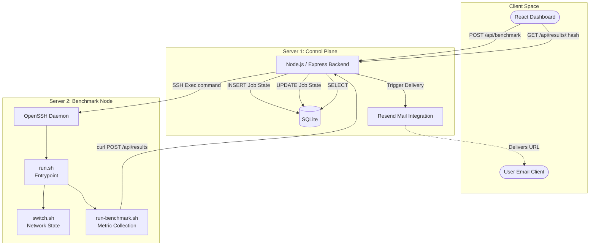
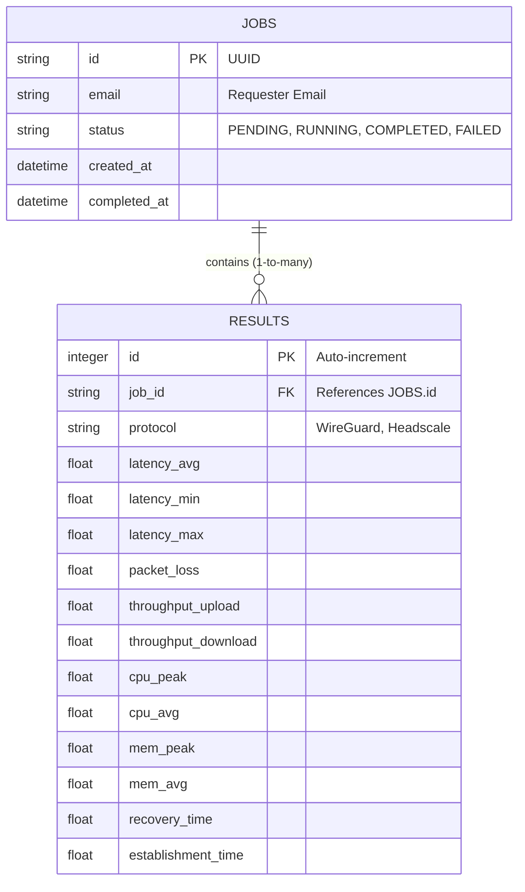

# VPNLens Software Implementation and Component Architecture

## Introduction

VPNLens is designed as a highly modular, multi-tiered application. It is divided into strictly independent layers, ensuring that changes to the user interface do not mandate refactoring the benchmark execution engine, and vice versa. 

The software stack is organized into the following distinct responsibilities:
*   **Frontend (Presentation Layer):** Handles user interaction, data visualization, and job submission.
*   **Backend (Orchestration Layer):** Acts as the central state machine, managing job queues, database writes, and external API integrations.
*   **Database (Persistence Layer):** Stores benchmark configurations, job states, and numerical results.
*   **Infrastructure (Network Layer):** Manages the reverse proxy, TLS termination, and the VPN tunnel endpoints.
*   **Benchmark Runner (Execution Layer):** The isolated bash scripts responsible for the physical evaluation of the network interfaces.
*   **Automation (Delivery Layer):** Handles the asynchronous delivery of reports via transactional email.

This strict separation of concerns allows VPNLens to operate deterministically. The frontend knows nothing about SSH keys; the bash scripts know nothing about the SQLite schema. Each component communicates via strictly defined interfaces (REST, SSH, file system).

---

## Software Architecture

The following diagram illustrates the complete software architecture, tracing the execution path from the client to the underlying operating system of the Benchmark Node.



---

## Frontend Implementation

The Presentation Layer is a Single Page Application (SPA) built to consume the backend's REST APIs.

### Technology Stack

* **React:** Chosen for its component-based architecture, allowing the encapsulation of complex UI elements (like metric charts and latency gauges) into reusable modules.
* **Vite:** Selected as the build tool and development server over Webpack. Vite offers significantly faster Hot Module Replacement (HMR) and optimized build times, aligning with the project's engineering-first, low-overhead philosophy.

### Component-Based Architecture

The frontend codebase is highly modular, split by domain logic:

* **Pages:** Top-level route components.
* `Dashboard`: The entry point containing the benchmark submission form and current queue status.
* `Results`: A dynamic route (`/results/:id`) that fetches and visualizes a specific benchmark run.
* `Benchmark History`: A tabular view of all historically executed tests.


* **Components:** Reusable UI pieces.
* `Charts`: Utilizes charting libraries (e.g., Recharts/Chart.js) to map the JSON payload into comparative bar and line graphs (e.g., WireGuard vs. Headscale CPU usage).
* `Network Topology`: A static component visualizing the current state of the test environment.
* `Email Modal`: Handles the user input for the async report delivery.


* **Services / API Layer:** A dedicated module (`api.js` or equivalent) that abstracts the `fetch` calls to the Node.js backend. This isolates the HTTP protocol logic from the React rendering lifecycle.

---

## Backend Implementation

The Orchestration Layer is the core intelligence of VPNLens. It is an event-driven HTTP server that bridges the web frontend with the Linux operating system of the Benchmark Node.

### Technology Stack

* **Node.js & Express:** Node.js was chosen for its non-blocking, asynchronous I/O model. Express provides a minimalist routing framework. This combination is ideal for a backend whose primary job is waiting for external processes (SSH execution, Database I/O, external API calls) to complete.

### Core Responsibilities

* **REST API:** Exposes endpoints (`/benchmark`, `/results`, `/queue`) for the frontend and the remote Bash scripts.
* **Benchmark Orchestration:** Manages a First-In-First-Out (FIFO) queue. It prevents concurrent execution by holding new requests in a "Pending" state if the Benchmark Node is currently locked.
* **Validation:** Sanitizes user inputs (email formats) and strictly validates the incoming JSON payloads from the Benchmark Node to prevent malicious metric injection or schema corruption.
* **Result Processing:** Parses the raw string/JSON output from the execution scripts, normalizes the data, and maps it to the database models.
* **SSH Execution:** Utilizes a native Node.js SSH client (like `ssh2`) to securely trigger remote commands on Server 2 without relying on local shell subprocesses.

---

## Database Implementation

VPNLens uses a relational model to persist configuration state and benchmarking results.

### Technology Stack

* **SQLite:** Selected specifically for its embedded nature. It operates as a single file on the host filesystem, requiring no separate background daemon. Given that VPNLens processes benchmarks sequentially (one write operation every few minutes), the concurrency limits of SQLite are completely irrelevant, making it the perfect lightweight choice.

### Schema Design



* **Benchmark Requests (`JOBS`):** Tracks the lifecycle of a request. The `id` serves as the unique cryptographic token used in the final URL.
* **Benchmark Results (`RESULTS`):** Stores the raw numerical data. A single Job ID will have multiple Result rows (e.g., one for WireGuard, one for Headscale).

---

## Benchmark Execution Layer

The physical execution of the tests on Server 2 is governed by a trio of modular bash scripts.

### Script Hierarchy

* **`run.sh`:** The master entrypoint. The backend SSH client calls this script exclusively. Its job is to orchestrate the sub-scripts in the correct order, capture any fatal errors, and return a standardized exit code to Node.js.
* **`switch.sh`:** Responsible solely for network state manipulation. It parses arguments (e.g., `./switch.sh wireguard`), tears down active interfaces (`ip link delete`, `wg-quick down`), and brings up the requested tunnel.
* **`run-benchmark.sh`:** Responsible solely for payload generation and sampling. It assumes the tunnel is active. It runs `ping`, `iperf3`, and `free -m`, captures the stdout, and packages it into a JSON string.

### Why this separation?

Separating the logic into three distinct files ensures that modifying the `iperf3` flags in `run-benchmark.sh` does not accidentally break the `wg-quick` initialization logic in `switch.sh`. It enforces a Single Responsibility Principle within the bash layer.

---

## SSH Execution Strategy

To trigger scripts on Server 2, the Backend uses the SSH protocol.

**Workflow:**

1. Node.js parses the ED25519 private key.
2. An encrypted tunnel is formed to Server 2's SSH daemon.
3. The command `./scripts/run.sh` is executed.
4. The SSH connection is maintained only long enough to confirm the script started successfully.
5. Server 2 runs the tests and uses `curl` to POST the results back to the Node.js API over HTTPS.

### Engineering Trade-offs

**Why not install a REST API on Server 2?**
Installing a Node.js instance on the Benchmark Node to listen for API requests would require installing Node, npm, opening a firewall port, and securing that port with TLS. This violates the goal of keeping the Benchmark Node as lightweight and pristine as possible. SSH is built into every Linux distribution by default. It is the most secure, zero-dependency method for remote command execution available.

---

## Email System Integration

The delivery of results is fully asynchronous, integrated via the Resend API.

* **Workflow:** Once the final `POST` arrives from the Benchmark Node, the Express backend updates the SQLite job status to `COMPLETED`. It then invokes the Resend SDK.
* **Templates:** The Node.js server compiles an HTML email template.
* **Unique URLs:** The email injects the `JOBS.id` (a UUIDv4 token) to form the direct link: `https://vpnlens.samay15jan.com/results/[UUID]`.
* **Why Resend:** Selected for its developer-friendly SDK and robust deliverability rates compared to configuring a local SMTP server (like Postfix) on Server 1, which often results in emails being marked as spam.

---

## Folder Structure

The repository enforces modularity at the filesystem level.

* **`backend/`**: Contains the Node.js source (`server.js`, `controllers/`, `routes/`, `db/`). This directory is built into its own Docker container.
* **`configs/`**: The infrastructure state. Contains the `docker-compose.yml` defining the multi-container setup and the `Caddyfile` for reverse proxy routing.
* **`docs/`**: The documentation repository (where this file resides).
* **`public/`**: Static assets for the React application (favicon, `index.html` template).
* **`src/`**: The React frontend source (`components/`, `pages/`, `styles/`, `api.js`).
* **`scripts/`**: The bash scripts (`run.sh`, `switch.sh`, `run-benchmark.sh`). While stored here in version control, they are pushed to Server 2 during deployment.

---

## Error Handling

VPNLens assumes the network is hostile and scripts will occasionally fail.

* **Validation:** Express uses middleware to validate that incoming `POST` payloads match the expected JSON schema.
* **Benchmark Failures:** If `iperf3` fails to connect (e.g., due to a broken VPN tunnel), `run-benchmark.sh` captures the exit code, sets the throughput metrics to `0`, and POSTs a partial failure state.
* **SSH Failures:** If Server 2 is unreachable, Node.js catches the socket timeout, marks the SQLite job as `FAILED`, and releases the queue lock to prevent the platform from hanging indefinitely.
* **Recovery:** The system is designed to fail cleanly. If a test crashes mid-execution, the next job in the queue will trigger `switch.sh`, which automatically flushes the network state, ensuring the system recovers automatically without human intervention.

---

## Logging

Observability is maintained through specific logging boundaries:

* **Backend Logs:** Standard `stdout` captured by Docker. Logs HTTP requests, queue processing events, and SSH connection states.
* **Benchmark Logs:** The bash scripts tee their output to `/var/log/vpnlens/` on Server 2. This allows administrators to SSH in and manually review the exact `iperf3` raw terminal output if a metric looks suspicious.
* **Result Logs:** The final sanitized JSON is permanently recorded in the SQLite database.

---

## Design Decisions Summary

* **Express & React:** Standardized, ubiquitous technologies that allow open-source contributors to understand the codebase immediately without learning esoteric frameworks.
* **SQLite:** Zero-configuration, file-based database ideal for linear benchmarking writes.
* **Docker:** Absolute parity between local development and production deployments.
* **SSH over REST (Server 2):** Minimizes the attack surface and dependency footprint on the critical execution node.
* **Modular Scripts:** Decoupling state manipulation (`switch.sh`) from measurement (`run-benchmark.sh`) allows adding new VPN protocols without altering the core benchmarking logic.

---

## Maintainability

The codebase prioritizes **loose coupling**. If the frontend requires a new charting library, the Node.js backend remains untouched. If we switch the email provider from Resend to SendGrid, only one backend controller needs modification.

This separation of responsibilities guarantees ease of future extension. For example, adding support for OpenVPN simply requires adding an `openvpn` case statement to `switch.sh` and updating the frontend dropdown menu. The orchestration, database, and reporting engines remain completely agnostic to the protocol being tested.

---

## Future Improvements

The current implementation is stable and functional, but the architecture allows for significant future enhancements:

* **Worker Queues:** Replacing the native Node.js array queue with a robust Redis-backed queue (like BullMQ) to handle job retries, priority queuing, and persistence across backend restarts.
* **Live Streaming:** Implementing WebSockets to stream the `stdout` of Server 2 directly to the React dashboard in real-time, rather than waiting for the final email.
* **Authentication:** Implementing standard JWT or session-based authentication to restrict the execution of benchmarks to authorized engineers.
* **Historical Analytics:** Implementing aggregate endpoints in the API to generate trends (e.g., "Show me the average WireGuard throughput over the last 30 days").

---

## Conclusion

The implementation of VPNLens bridges modern web application practices with low-level Linux network engineering. By strictly separating the control plane from the execution environment, defining clear communication boundaries (REST, SSH), and embracing containerization, the software achieves high reliability and determinism.

With the internal architecture and implementation logic clearly defined, developers can interact programmatically with the platform. The subsequent documentation will detail the specific schemas, endpoints, and authentication mechanisms required in the API Documentation.

```

```