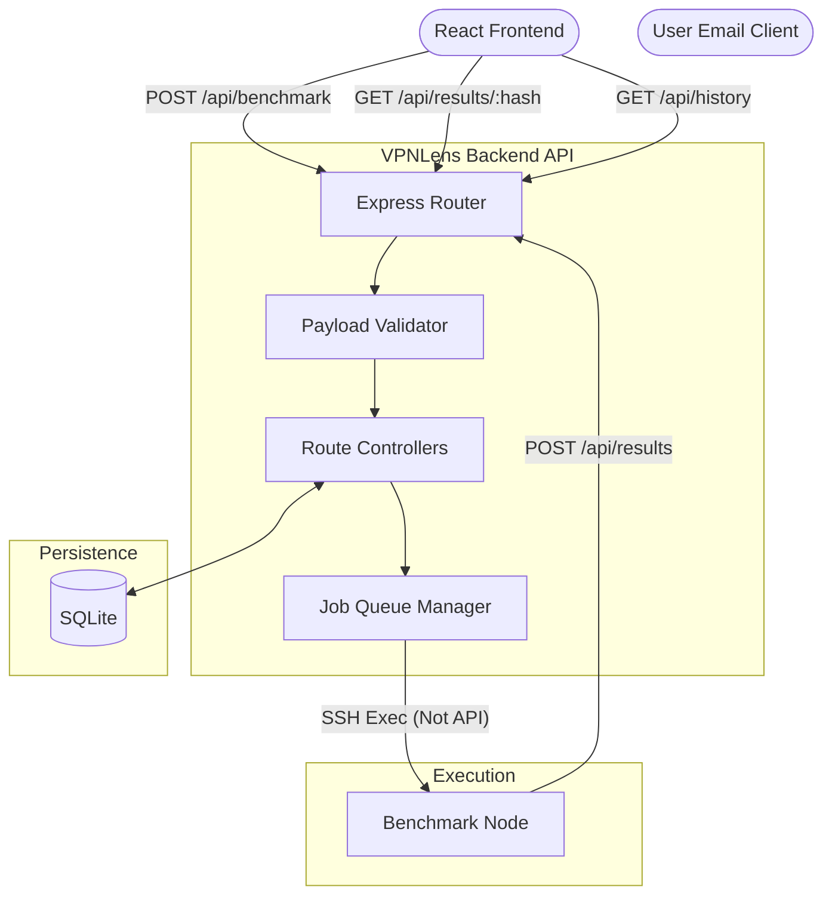
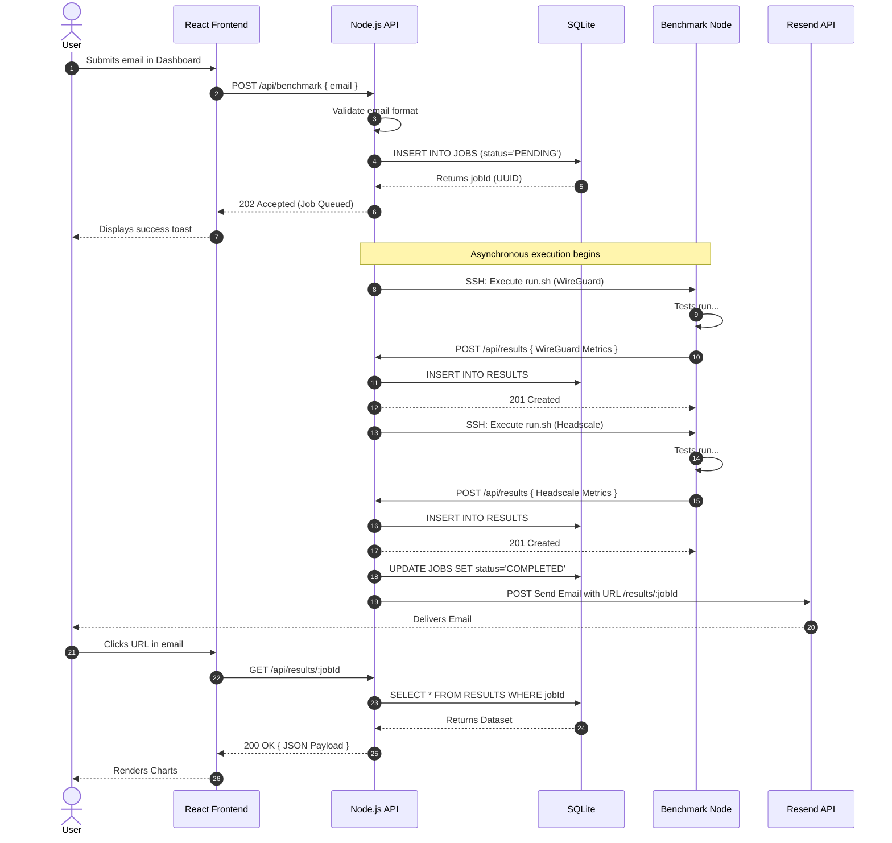

# VPNLens REST API Reference

## Introduction

The VPNLens platform operates on a strict Representational State Transfer (REST) architecture. This document serves as the official reference for the application programming interface (API) exposed by the VPNLens backend. 

The API serves as the critical boundary between the user interface (Frontend), the persistence layer (Database), and the execution environment (Benchmark Node). A core design principle of VPNLens is that the **Frontend never communicates directly with the benchmark server.** All requests, data submissions, and status queries flow through the centralized backend API. 

This architectural choice exists for several reasons:
1.  **Security:** Exposing the Benchmark Node to the public Internet to receive API requests from web browsers would create an unacceptable attack surface. The backend acts as a secure proxy and sanitization layer.
2.  **State Management:** The backend must maintain a strict First-In-First-Out (FIFO) queue. If the frontend communicated directly with the execution node, concurrent users could trigger overlapping benchmarks, destroying the validity of the data.
3.  **Data Integrity:** The backend enforces strict validation schemas on all incoming data, ensuring that malformed network metrics cannot corrupt the SQLite database.

This document details every endpoint, its purpose, the expected payloads, and the complete request lifecycle.

---

## API Overview

The API facilitates a unidirectional flow of orchestration and an asynchronous flow of data collection. The following diagram illustrates how the API interfaces with the broader system components.



---

## Authentication

The current iteration of VPNLens utilizes a segmented authentication model based on trust boundaries.

* **Public Frontend Endpoints:** Endpoints used by the React dashboard (such as requesting a benchmark or viewing a report) are currently public and unauthenticated. This allows frictionless usage for students and researchers evaluating the platform. Rate limiting (e.g., via Caddy or Express middleware) prevents basic denial-of-service, but explicit user authentication is not enforced on read-requests.
* **Internal Execution Endpoints:** The endpoint used by the Benchmark Node to submit results (`POST /api/results`) is protected by an internal pre-shared key (PSK) or token injected into the node's environment variables during deployment. This prevents malicious actors from POSTing fabricated metrics to the database.
* **Security Assumptions:** The platform assumes that the internal Docker network and the SSH tunnel to the Benchmark Node are secure. The API trusts the Benchmark Node's payload only if the correct internal token is provided.
* **Future Improvements:** Future iterations will implement JSON Web Tokens (JWT) for the frontend to introduce role-based access control (RBAC), ensuring only authorized infrastructure engineers can trigger cloud compute workloads.

---

## Endpoint Reference

The following sections document the implemented endpoints that drive the VPNLens platform.

### 1. Submit Benchmark Job

**Purpose:**
Initiates a new benchmark run. This endpoint accepts the user's email, creates a pending job in the database, adds the job to the orchestration queue, and immediately returns a success response. It does *not* wait for the benchmark to finish.

**Method:** `POST`
**URL:** `/api/benchmark`

**Headers:**

* `Content-Type`: `application/json`

**Request Body:**

```json
{
  "email": "engineer@example.com"
}

```

**Response Body:**

```json
{
  "status": "success",
  "message": "Benchmark job successfully queued.",
  "data": {
    "jobId": "f47ac10b-58cc-4372-a567-0e02b2c3d479",
    "queuePosition": 1
  }
}

```

**Status Codes:**

* `202 Accepted`: The request is valid and has been queued for background processing.
* `400 Bad Request`: The email provided is invalid or missing.
* `429 Too Many Requests`: The user has exceeded the rate limit for submitting jobs.
* `500 Internal Server Error`: The database failed to create the job record.

**Notes:**
The use of `202 Accepted` instead of `200 OK` or `201 Created` is highly intentional. In REST semantics, `202` indicates that the request has been accepted for processing, but the processing has not been completed. This accurately reflects the asynchronous nature of network benchmarking.

---

### 2. Submit Benchmark Results

**Purpose:**
This endpoint is consumed *exclusively* by the Benchmark Node (Server 2) via `curl` at the end of its bash script execution. It receives the raw network metrics, validates them against the expected schema, and updates the specific `jobId` in the database.

**Method:** `POST`
**URL:** `/api/results`

**Headers:**

* `Content-Type`: `application/json`
* `Authorization`: `Bearer <INTERNAL_NODE_TOKEN>`

**Request Body:**

```json
{
  "jobId": "f47ac10b-58cc-4372-a567-0e02b2c3d479",
  "protocol": "WireGuard",
  "metrics": {
    "latency_min": 12.4,
    "latency_avg": 13.1,
    "latency_max": 15.8,
    "packet_loss": 0.0,
    "throughput_upload": 850.5,
    "throughput_download": 910.2,
    "cpu_avg": 14.5,
    "cpu_peak": 18.2,
    "mem_avg": 45.0,
    "mem_peak": 48.0,
    "connection_time": 120,
    "recovery_time": 15
  }
}

```

**Response Body:**

```json
{
  "status": "success",
  "message": "Protocol metrics successfully recorded."
}

```

**Status Codes:**

* `201 Created`: The metrics were successfully parsed and written to the SQLite database.
* `400 Bad Request`: The payload failed schema validation (e.g., passing a string for throughput instead of a float).
* `401 Unauthorized`: The `INTERNAL_NODE_TOKEN` was missing or invalid.
* `404 Not Found`: The provided `jobId` does not exist in the database.
* `500 Internal Server Error`: Database write failure.

**Notes:**
Because the benchmark node evaluates two protocols (WireGuard and Headscale) sequentially, this endpoint will be called *twice* per `jobId`. The backend controller logic tracks these submissions. Upon receiving the second successful POST, the backend updates the job status to `COMPLETED` and triggers the Resend email notification.

---

### 3. Retrieve Specific Benchmark Report

**Purpose:**
Fetches the consolidated results for a specific benchmark run. This endpoint is called by the React frontend when a user clicks the unique URL provided in their email (e.g., `https://vpnlens.samay15jan.com/results/[hash]`).

**Method:** `GET`
**URL:** `/api/results/:hash`

**Headers:**

* `Accept`: `application/json`

**Response Body:**

```json
{
  "status": "success",
  "data": {
    "jobId": "f47ac10b-58cc-4372-a567-0e02b2c3d479",
    "created_at": "2026-07-04T10:15:30Z",
    "completed_at": "2026-07-04T10:22:45Z",
    "results": [
      {
        "protocol": "WireGuard",
        "metrics": {
          "latency_avg": 13.1,
          "throughput_upload": 850.5,
          "throughput_download": 910.2,
          "cpu_peak": 18.2,
          "recovery_time": 15
        }
      },
      {
        "protocol": "Headscale",
        "metrics": {
          "latency_avg": 24.5,
          "throughput_upload": 610.3,
          "throughput_download": 630.1,
          "cpu_peak": 45.1,
          "recovery_time": 1250
        }
      }
    ]
  }
}

```

**Status Codes:**

* `200 OK`: The report was found and returned.
* `404 Not Found`: The UUID hash does not correspond to a valid job, or the job has not yet completed.
* `500 Internal Server Error`: Database read failure.

**Notes:**
The backend abstracts the relational database structure. It performs a SQL `JOIN` on the `JOBS` and `RESULTS` tables, formatting the data into a hierarchical JSON structure that the React charting components can easily consume without further data manipulation on the client side.

---

### 4. Retrieve Benchmark History

**Purpose:**
Fetches a paginated summary of all historical benchmark runs. This endpoint feeds the "Benchmark History" tabular view on the frontend dashboard.

**Method:** `GET`
**URL:** `/api/history`

**Query Parameters:**

* `limit` (optional): Integer (default: 20). Maximum number of records to return.
* `page` (optional): Integer (default: 1). Offset calculation for pagination.

**Response Body:**

```json
{
  "status": "success",
  "meta": {
    "total_records": 142,
    "current_page": 1,
    "total_pages": 8
  },
  "data": [
    {
      "jobId": "f47ac10b-58cc-4372-a567-0e02b2c3d479",
      "status": "COMPLETED",
      "created_at": "2026-07-04T10:15:30Z"
    },
    {
      "jobId": "a12bc34d-56ef-7890-abcd-1234567890ab",
      "status": "FAILED",
      "created_at": "2026-07-04T09:12:10Z"
    }
  ]
}

```

**Status Codes:**

* `200 OK`: History successfully retrieved.
* `500 Internal Server Error`: Database query failure.

**Notes:**
To protect user privacy, this endpoint explicitly omits the `email` column from the database query. It only returns the job hashes, status, and timestamps.

---

## Request Lifecycle

Understanding the temporal flow of an API request is critical for working with VPNLens, as the platform bridges synchronous web requests with asynchronous infrastructure jobs.



---

## Error Responses

The API uses standard HTTP status codes to indicate the success or failure of a request. The response body for an error always follows a consistent schema:

```json
{
  "status": "error",
  "code": "VALIDATION_FAILED",
  "message": "The provided email address is invalid."
}

```

* **`400 Bad Request`:** Caused by Validation failures. This occurs if the frontend sends a malformed email, or if the bash script attempts to POST a string instead of a floating-point number for a metric.
* **`401 Unauthorized`:** Caused by authentication failures. Strictly reserved for the `POST /api/results` endpoint when the internal node token is rejected.
* **`404 Not Found`:** Caused when requesting a `jobId` that does not exist in SQLite, or querying an API route that is undefined.
* **`500 Internal Server Error`:** Caused by backend infrastructural failures. This includes:
* **Database Failures:** SQLite file is locked or corrupted.
* **SSH Failures:** The Node.js `ssh2` client times out attempting to reach Server 2.
* **Benchmark Failures:** The `run.sh` script exits with a non-zero status code, prompting the API to forcefully update the database job status to `FAILED`.


---

## Validation

Input validation is the primary defense against corrupted data and application crashes.

* **Email Validation:** The `POST /api/benchmark` endpoint utilizes strict Regex validation to ensure the provided string is a valid RFC 5322 email address before queuing the job.
* **Payload Validation:** The `POST /api/results` endpoint uses a schema validation library (such as Joi or Zod). It ensures that every metric field exists.
* **Metric Validation:** The API enforces data types (e.g., `throughput_upload` must be a positive `float` or `integer`). If a bash script fails and outputs an empty string or a bash error message instead of a number, the API validation catches it and rejects the payload, preventing `NaN` (Not a Number) values from corrupting the database charts.
* **Token Validation:** UUIDs passed to `/api/results/:hash` must match the standard 36-character UUIDv4 format. If a user attempts to pass a SQL injection payload via the URL parameter, the route validator drops the request before it reaches the SQLite driver.

---

## Database Interaction

The API relies on SQLite for state persistence. The controllers interact with the database using parameterized queries to prevent SQL injection.

* **Benchmark Requests:** `POST /api/benchmark` performs a fast `INSERT` into the `JOBS` table, generating the UUID.
* **Benchmark Results:** `POST /api/results` performs an `INSERT` into the `RESULTS` table, tying the metrics to the `jobId` via a foreign key relationship.
* **Unique Report Tokens:** The `jobId` serves as the cryptographically unique report token. Because UUIDv4 tokens have 122 bits of randomness, they are functionally impossible to enumerate or guess, ensuring users can only view reports they possess the link to.
* **History:** `GET /api/history` performs a `SELECT` with `ORDER BY created_at DESC LIMIT X OFFSET Y`, allowing efficient pagination without loading the entire database into memory.

---

## Security Considerations

While VPNLens is an open-source evaluation tool rather than a financial application, API security remains a priority.

* **HTTPS:** All API traffic is encrypted in transit via Caddy. The API will refuse to parse plain HTTP traffic.
* **Input Validation:** As detailed above, strict typing prevents NoSQL/SQL injection attacks.
* **Server-to-Server Communication:** The Node.js backend triggers the Benchmark Node via SSH (using ED25519 keys, never passwords). The Benchmark Node replies via HTTPS.
* **API Abuse:** The public nature of the `/api/benchmark` endpoint makes it susceptible to spam. Currently, the architecture relies on edge-level rate limiting.
* **Appropriate Scope:** The current security model is highly appropriate for the project's scope. VPNLens does not store personally identifiable information (PII) beyond emails used for delivery, nor does it process payments. Implementing complex OAuth flows would introduce unnecessary friction for students and researchers.
* **Future Enhancements:** If the platform scales to support multi-tenant infrastructure evaluation, API Keys will be issued for programmatic access, and JWTs will be utilized for dashboard authentication.

---

## Future API

The API is designed for extensibility. Future roadmap items include:

* **Authentication Endpoints:** `/api/auth/login` to support administrative dashboards.
* **WebSockets:** Transitioning the queue status from a polling architecture to a WebSocket connection (`ws://backend.vpnlens.../api/stream`), allowing the frontend to display real-time terminal output from the Benchmark Node.
* **Scheduled Benchmarks:** Adding a `POST /api/schedules` endpoint to allow users to define cron-like recurrence (e.g., "Run WireGuard benchmark every 6 hours").
* **Historical Comparisons:** Adding analytical endpoints (e.g., `GET /api/analytics/compare?protocol=WireGuard&timeframe=30d`) to offload aggregate data calculations from the React client to the Node.js backend.

---

## Conclusion

The VPNLens REST API is a purposefully designed interface that bridges web applications with low-level Linux networking tools. By strictly enforcing asynchronous job queuing, rigorous payload validation, and decoupled execution, the API guarantees that the platform remains stable, secure, and highly deterministic.

Understanding the API payload structures is only one half of the execution equation. To fully understand how these JSON payloads are generated from raw system metrics, proceed to the Scripts documentation.

```

```