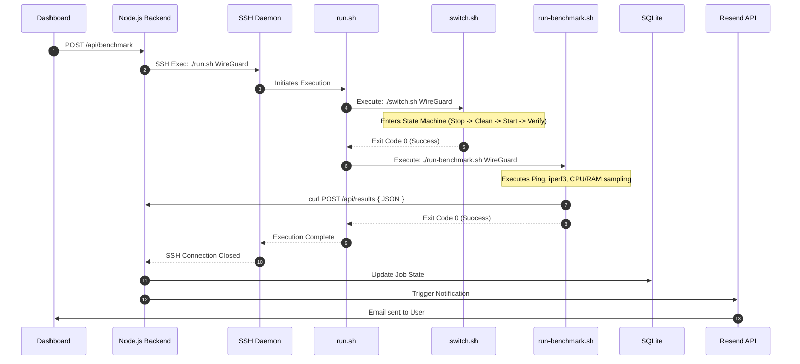
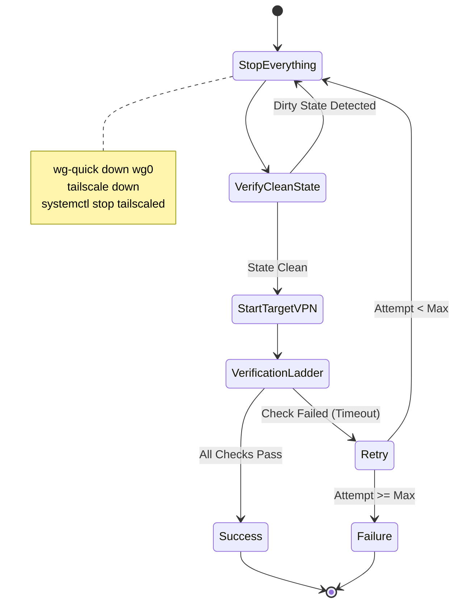
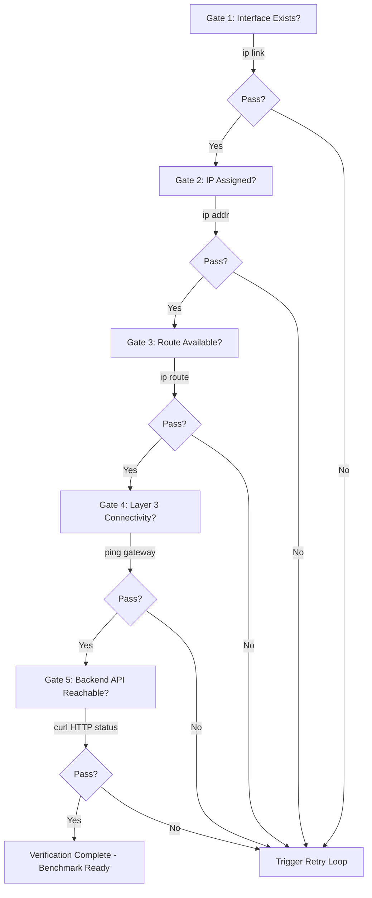

# VPNLens: Scripting and Automation Architecture

## Introduction

In the initial conception of VPNLens, benchmarking was viewed as a manual operation. The original workflow assumed an engineer would SSH into a server, manually provision a WireGuard or Headscale interface, run `iperf3` commands, and record the terminal output. However, as the project evolved into an enterprise-grade evaluation platform, it became immediately apparent that manual execution was the enemy of reliable data. 

Manual execution introduces timing variances, lingering network state corruption, and observer bias (such as the CPU overhead of an active SSH session parsing terminal output). Consequently, **automation became the heart of VPNLens.** The primary objective shifted from merely comparing two VPNs to building an unshakeable, automated orchestration engine capable of managing Linux networking states and executing rigorous stress tests without human intervention. 

This document details the software automation layer of VPNLens—the bash scripts that reside on the Benchmark Node. It explains the engineering rationale behind their existence, their strict separation of responsibilities, and how they interact to form a deterministic benchmarking pipeline.

---

## Automation Philosophy

The scripting architecture of VPNLens is governed by a strict adherence to Unix philosophy and modern infrastructure-as-code principles:

*   **One Responsibility Per Script:** Monolithic scripts are fragile. By breaking automation into focused, single-purpose scripts, the system becomes highly modular.
*   **Composable Scripts:** Scripts must be able to call one another, passing state via exit codes and strictly defined environment variables.
*   **Small Independent Units:** Smaller scripts limit the blast radius of a failure and dramatically simplify testing.
*   **Easy Debugging:** When an automation pipeline fails, the engineer must know exactly *which* phase failed (e.g., interface initialization vs. payload generation).
*   **Reproducibility:** A script executed a thousand times must yield the exact same environmental state every single time. The scripts must be idempotent where possible.
*   **Automation over Manual Execution:** The scripts must execute completely headless. They cannot prompt for user input, require `sudo` password prompts during runtime, or rely on interactive shells.

**Why Shell Scripts Were Selected:**
Bash was selected over higher-level languages (like Python or Go) for the Benchmark Node execution layer specifically to eliminate dependencies. Every modern Linux distribution ships with bash, standard GNU coreutils (`grep`, `awk`, `sed`), and `iproute2`. By writing the orchestration layer in shell, the Benchmark Node requires zero custom agent installations, minimizing its memory footprint and preserving 100% of the compute resources for the actual network benchmark.

---

## Script Overview

The automation layer is divided into three primary files. 

| Script | Purpose | Responsibilities | Inputs | Outputs | Dependencies |
| :--- | :--- | :--- | :--- | :--- | :--- |
| `run.sh` | Orchestration Entrypoint | Coordinates the execution order. Handles global error trapping. Calls `switch.sh` then `run-benchmark.sh`. | Target VPN Protocol, Backend API URL | Exit Code (`0` for success, non-zero for failure) | Bash |
| `switch.sh` | Network State Management | Tears down existing interfaces. Flushes `iptables`. Brings up the target VPN. Verifies route availability. | Target VPN Protocol | Active Network Interface, Exit Code | `iproute2`, `wg-quick`, `tailscale` |
| `run-benchmark.sh` | Payload Generation & Collection | Executes network stress tests. Samples CPU/RAM. Formats data into JSON. POSTs to Backend. | Target VPN Protocol, Backend API URL | JSON POST payload, Exit Code | `iperf3`, `ping`, `curl`, `jq` |

**The Relationship:**
`run.sh` is the parent process. It spawns `switch.sh` as a synchronous child process. If `switch.sh` returns a successful exit code (`0`), `run.sh` spawns `run-benchmark.sh`. If any child script fails, `run.sh` halts execution, attempts a graceful teardown, and reports the failure back to the Node.js backend.

---

## Overall Workflow

The following diagram illustrates the complete end-to-end automation pipeline, highlighting how the Node.js backend triggers the bash layer, and how the bash layer returns data.



---

## `run.sh`

### Purpose

`run.sh` serves as the master execution wrapper and entrypoint for the remote SSH command.

### Why it exists

When the Node.js backend connects to Server 2, it needs a single, predictable command to execute. If the backend had to manually send a sequence of commands (e.g., `cd /scripts && ./switch.sh wg && ./run-benchmark.sh wg`), a dropped SSH connection mid-sequence would leave the server in a zombie state. `run.sh` encapsulates the entire lifecycle into a single atomic command.

### Responsibilities

1. **Argument Parsing:** Receives the target protocol from the backend.
2. **Global Error Trapping:** Utilizes `set -e` and `trap` to catch unexpected terminal interrupts (SIGINT, SIGTERM) and execute cleanup routines.
3. **Process Orchestration:** Calls the child scripts in the correct sequential order.

### Workflow

1. Initialize logging context.
2. Invoke `switch.sh <protocol>`.
3. Evaluate `switch.sh` exit code.
4. If successful, invoke `run-benchmark.sh <protocol>`.
5. Evaluate `run-benchmark.sh` exit code.
6. Exit with a final aggregate status code.

### Engineering Trade-offs & Maintainability

**Why not embed all logic inside one script?**
Initially, VPNLens utilized a single monolithic `benchmark.sh` script. However, as the platform grew, this became a maintenance nightmare. Network switching requires root-level routing table manipulation, while running `iperf3` and formatting JSON does not. By splitting the logic, `run.sh` acts merely as an orchestrator. If a developer needs to tweak the `iperf3` TCP window size, they open `run-benchmark.sh` and have zero risk of accidentally breaking the `wg-quick` initialization logic. This modularity ensures long-term maintainability.

---

## `switch.sh`

### Purpose

`switch.sh` is the most complex operational script in the repository. Its sole purpose is to mutate the Linux kernel's network state from an unknown, potentially corrupted state into a mathematically pristine, verified tunnel connection.

### Why VPN switching is difficult

Modern VPNs are invasive.

* **WireGuard (`wg-quick`):** Injects specific rules into `iptables`, manipulates `resolvconf` for DNS, and creates virtual `wg0` network interfaces.
* **Headscale (`tailscaled`):** Uses complex `nftables` or `iptables` rulesets for NAT traversal, establishes multiple concurrent UDP sessions for hole punching, and actively manages the `tailscale0` interface.

If a script simply runs `wg-quick up wg0` without first ensuring `tailscale` is completely shut down, the kernel routing table will encounter metric collisions. Traffic destined for the internal subnet will be blackholed. `switch.sh` exists to aggressively sanitize this environment.

### The Complete State Machine



### State Machine Phases

1. **Stop Everything:** The script assumes the node is dirty. It aggressively runs `down` commands for *every* supported VPN protocol, regardless of what is currently active. It flushes orphaned `iptables` chains and deletes lingering virtual interfaces.
2. **Verify Clean State:** It checks `ip link show` to guarantee no overlay interfaces exist before proceeding.
3. **Start Target VPN:** It executes the specific initialization command for the requested protocol.
4. **Verification Ladder:** (Detailed in the next section).
5. **Success/Retry/Failure:** The script evaluates the output.

### Retry Logic

Networks are volatile. A DNS resolution failure or a temporary control-plane timeout shouldn't invalidate the entire benchmark queue. `switch.sh` implements an exponential backoff retry loop. If Headscale fails to authenticate with the control server, the script waits 5 seconds, loops back to **Stop Everything**, and tries again (up to 3 times).

### Why both VPNs are always stopped

Even if the backend requests a WireGuard benchmark, and WireGuard is *already* running, `switch.sh` will bring WireGuard down and bring it back up. **Why?** To ensure a level playing field. If WireGuard had been running for 5 hours, its UDP connection tracking tables and memory buffers would be different than a freshly started Headscale instance. Forcing a teardown guarantees that every benchmark starts from "second zero."

---

## Verification Ladder

A common mistake in network automation is starting a payload test immediately after issuing the `up` command. Interface creation does not equal routing capability. `switch.sh` implements a strict "Verification Ladder"—a series of sequential gates that must be passed before the tunnel is deemed active.



**Why multiple verification stages are more reliable than a single ping:**
If a script relies solely on `ping`, and the ping fails, the script has no context as to *why*. Did the interface fail to spawn? Did the DHCP assignment fail? Did the cryptographic handshake fail? By walking up the OSI model (Layer 2 Interface -> Layer 3 Routing -> Layer 4 Connectivity -> Layer 7 HTTP), the script can log exactly where the failure occurred, making debugging highly efficient.

---

## `run-benchmark.sh`

### Purpose

Once `switch.sh` has guaranteed a pristine, routing network interface, `run-benchmark.sh` takes over. Its sole responsibility is generating extreme network load, capturing the resulting hardware and software metrics, and delivering them to the database.

### Responsibilities

* Execute standard network evaluation binaries (`ping`, `iperf3`).
* Sample Linux kernel resource metrics (`/proc/stat`, `free`).
* Measure the specific Recovery Time of the active protocol.
* Format variables into a compliant JSON structure.
* POST the data to the Node.js backend.

### Benchmark Lifecycle

1. **Ping (Latency & Packet Loss):**
Executes `ping -c 100 -i 0.2 <target_ip>`. It uses `awk` and `sed` to parse the `min/avg/max` latency values and the percentage of packet loss from the standard output.
2. **iperf3 Upload (Throughput):**
Executes `iperf3 -c <target_ip> -t 15 -J`. Generates a TCP payload stream originating from the Benchmark Node. The `-J` flag forces JSON output, which the script parses using `jq` to extract the `bits_per_second` variable.
3. **iperf3 Download (Throughput):**
Executes `iperf3 -c <target_ip> -t 15 -R -J`. The `-R` (Reverse) flag forces the Server 1 endpoint to push data to the Benchmark Node, testing asymmetric network limitations.
4. **CPU Sampling:**
While `iperf3` is actively running in the background, a sub-shell runs `top -b -n 1` to capture the CPU utilization of the specific VPN daemon (`tailscaled` or the kernel thread for WireGuard), capturing both average and peak loads during encryption.
5. **Memory Sampling:**
Executes `free -m` during the payload test to capture the RAM footprint of the userspace components.
6. **Recovery Time Test:**
The script intentionally executes `ip link set <interface> down` followed immediately by `ip link set <interface> up`. It then runs a high-frequency `ping` loop. The script calculates the precise millisecond delta between the `up` command and the first successful ICMP reply.
7. **Generate Payload & POST:**
Constructs a JSON string combining all collected variables and executes a `curl POST` to `/api/results`.

### Why JSON Payloads Were Chosen

Early versions of VPNLens attempted to parse standard terminal text output via SSH on the Node.js backend. This proved incredibly brittle. A single unexpected warning message from `iperf3` would break the backend parser. By forcing the bash script to format the data into strict JSON using `jq`, the script guarantees the API receives a strongly-typed, schema-compliant object.

---

## Script Communication

Because the scripts are modular, they must communicate state flawlessly.

* **Inputs:** `run.sh` receives arguments directly from the SSH command string (e.g., `wg` or `hs`). It passes these arguments to `switch.sh` and `run-benchmark.sh` as `$1`.
* **Environment Variables:** Sensitive data, such as the `API_BEARER_TOKEN` required for the `POST` request, is injected into the Benchmark Node's environment via `.bashrc` or a `.env` file loaded at runtime. This keeps secrets out of the script source code.
* **Exit Codes:** This is the primary communication mechanism. Unix standard exit codes are strictly enforced. `0` means complete success. `1` means a general failure. `2` means a validation/input failure. `3` means a network timeout. `run.sh` inspects `$?` after every child execution to determine the control flow.
* **Outputs:** The only output that leaves the Benchmark Node is the asynchronous `curl POST` containing the JSON payload. The stdout of the scripts is logged locally, not relied upon by the backend.

---

## Error Handling

Error handling in bash requires defensive programming. If a command fails in a shell script, the script typically continues executing the next line, which can lead to catastrophic cascading failures.

### Philosophy

The error handling philosophy is **"Fail Fast, Fail Clean."**

* **Verification:** `set -e` is used at the top of every script to ensure that if any untested command fails, the script immediately halts.
* **Retries:** Intermittent network failures are handled by the exponential backoff retry loops in `switch.sh`.
* **Graceful Failures:** If a script fails completely, a `trap 'cleanup' ERR` command ensures that an emergency teardown function is called, preventing broken interfaces from lingering in the kernel.
* **SSH Failures:** If the SSH connection itself drops during `iperf3` (a common occurrence when the NIC is saturated at 100% bandwidth), the backend Node.js server implements a timeout mechanism. It will forcefully mark the job as `FAILED` in the database, ensuring the queue is not permanently locked.

---

## Logging

Observability in headless scripts is critical for infrastructure debugging.

* **Console Logs:** The scripts utilize `echo` statements heavily, prefixed with timestamps and log levels (e.g., `[INFO]`, `[WARN]`, `[ERROR]`).
* **Verbose Execution:** During development and troubleshooting, the scripts can be executed with `bash -x`, which prints every executed command and expanded variable to the console.
* **Benchmark Logs:** Standard output and standard error (stderr) are redirected and teed to a persistent log file (`/var/log/vpnlens/benchmark.log`) on the Benchmark Node.

**Why verbose logging became important:**
During early development, benchmarks would sporadically fail. Without persistent local logs, it was impossible to determine if the failure was a Headscale control-plane timeout or an `iperf3` binary crash. By logging every phase of the Verification Ladder, the engineering team could pinpoint exactly where the state machine broke down.

---

## Engineering Decisions

The automation architecture is the result of several deliberate engineering choices:

* **Why Separate Scripts:** Enforces the Single Responsibility Principle. State management and metric collection are fundamentally different tasks.
* **Why Shell Scripting:** Zero dependencies. Maximum portability. Native interaction with the Linux kernel and `iproute2`.
* **Why SSH for Orchestration:** Avoids running a long-lived API daemon on the Benchmark Node, reducing its attack surface and memory footprint.
* **Why Retry Logic:** Cloud networks drop packets. A single missed ping should not invalidate an entire benchmark suite.
* **Why the Verification Ladder:** Ensures that testing only begins when the OSI model is fully operational from Layer 2 through Layer 7.
* **Why Sequential Execution:** Parallel execution splits NIC bandwidth and CPU time, rendering network performance metrics entirely invalid.
* **Why Modularity:** Allows the effortless future addition of OpenVPN or IPsec without rewriting the `run-benchmark.sh` collection logic.

---

## Script Evolution

The current automation architecture did not emerge fully formed. It is the result of painful lessons in Linux network engineering.

1. **Initially (Manual Commands):** The project began with engineers typing commands into a terminal and pasting results into Excel. This was instantly discarded as irreproducible.
2. **The Monolith (Single Script):** The first automation attempt was a single 300-line bash script. It was brittle. If `iperf3` crashed, the script exited, leaving the WireGuard interface up. The next run would fail due to routing collisions.
3. **Splitting Responsibilities:** The monolith was divided into `switch.sh` and `run-benchmark.sh` to isolate interface teardown logic from payload generation.
4. **Implementing Verification:** We discovered `iperf3` was returning `0 Mbps` because it was executing *before* the cryptographic handshake completed. The Verification Ladder was introduced to block execution until the tunnel was genuinely routing.
5. **Adding Retries:** Headscale's stateful control plane occasionally took longer to respond than WireGuard. Strict timeouts were causing false failures. Retry logic with exponential backoff stabilized the automation, resulting in the current robust pipeline.

---

## Future Improvements

The scripting architecture is stable, but infrastructure automation is an ever-evolving field. Future roadmap items include:

* **Terraform Integration:** Scripts currently assume the OCI VM exists. Future iterations will include Terraform to dynamically provision Server 2 via API before calling `run.sh`.
* **Ansible Integration:** Replacing manual `apt-get` installations with Ansible playbooks to guarantee the Benchmark Node's dependencies are installed idempotently.
* **Remote Workers:** Modifying `run.sh` to accept target IP arguments, allowing the backend to orchestrate a distributed fleet of Benchmark Nodes globally.
* **Additional VPNs:** Extending the `switch.sh` case statements to include OpenVPN and Nebula.

---

## Lessons Learned

Building the VPNLens automation engine provided deep insights into infrastructure engineering:

* **Linux Networking is Stateful and Messy:** You cannot trust the OS to clean up after a VPN. Automation must explicitly tear down interfaces, flush `iptables`, and verify routing tables.
* **Automation Requires Idempotency:** A script must be able to run safely whether the system is in a pristine state or a completely broken state. The "Stop Everything" phase is the most critical part of the entire pipeline.
* **Failing Early is Better than Failing Late:** The Verification Ladder proved that it is better for a script to fail and report "No Route to Host" than to run a 60-second `iperf3` test that results in garbage data.

---

## Conclusion

The bash scripting layer of VPNLens transforms a collection of network utilities into a highly reliable, deterministic orchestration engine. By adhering to strict modularity, aggressive state verification, and comprehensive error handling, the automation pipeline guarantees that the data flowing into the database is uncorrupted by environmental noise.

Understanding this execution layer completes the technical picture of how VPNLens operates. To understand the context in which this platform was built, and the academic research that drove these engineering decisions, proceed to the Development History documentation.

```

```