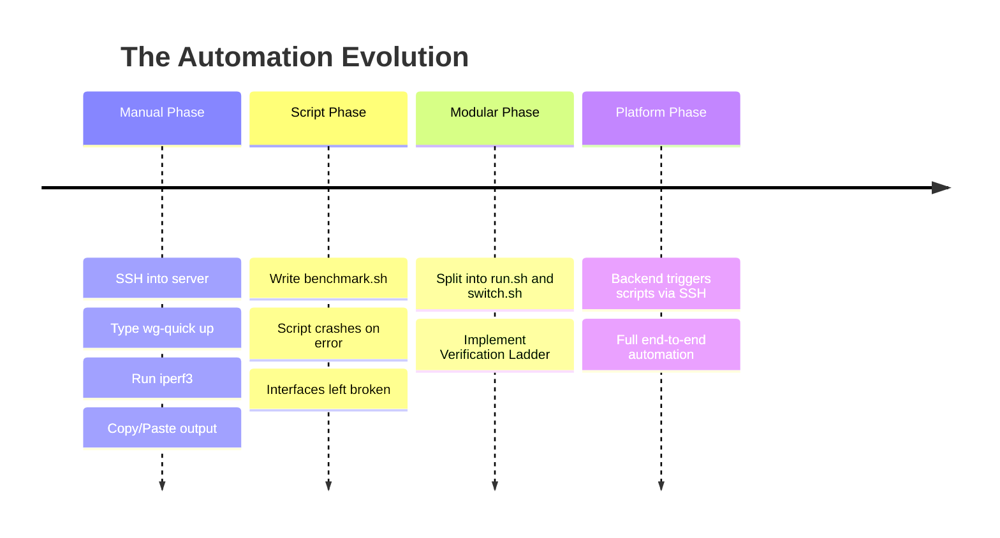

# VPNLens: The Engineering History and Development Retrospective

## Preface

Software engineering is rarely a linear journey from a pristine design document to a flawless execution. When users, recruiters, or future contributors look at a finished open-source repository, they see the polished artifact: clean code, organized directories, passing CI/CD pipelines, and functional dashboards. What they do not see is the graveyard of abandoned architectures, the late-night debugging sessions parsing obscure Linux kernel logs, the fundamental redesigns, and the flawed assumptions that had to be unlearned.

This document serves as the official engineering diary of VPNLens. It intentionally shatters the illusion of perfect foresight. It is written to preserve the complete developmental history of the platform. By documenting not just *what* VPNLens is, but *why* it became what it is, this retrospective aims to provide deep context for future maintainers, serve as a study in systems evolution for students, and stand as a transparent record of the engineering trade-offs made along the way.

---

## Where Everything Started

VPNLens did not begin as an end-to-end benchmarking platform. It began as a straightforward university internship project with a simple title: **"Comparison of Centralized and Peer-to-Peer Open Source VPN Architectures."**

The initial scope was strictly academic. The objective was to manually set up WireGuard (representing the centralized, hub-and-spoke model) and Headscale (representing the peer-to-peer, stateful mesh model), run a few `iperf3` tests, and write a final report summarizing the findings.

There was no plan for a React dashboard. There was no plan for a Node.js backend. There was no plan for automated bash orchestration, job queues, or email notifications. The expectation was that a human would type commands into a terminal, copy the numbers into an Excel spreadsheet, and generate a PDF.

---

## Phase 1 — Research

Before writing a single line of code, the project required a deep theoretical understanding of the two target architectures. This phase involved extensive reading of protocol whitepapers, official documentation, and community discussions.

* **Learning WireGuard:** We had to understand Cryptokey Routing. WireGuard's brilliance lies in its simplicity and its integration directly into the Linux kernel (`wireguard-linux`). It is fundamentally stateless; it does not "connect," it merely encrypts and routes packets based on static public keys.
* **Learning Headscale:** Headscale is the open-source implementation of Tailscale's control plane. This required learning about NAT traversal (STUN/TURN), coordination servers, and the `wireguard-go` userspace implementation. It was critical to understand that Headscale manages the *keys* and the *routing*, while the data plane still uses WireGuard under the hood.
* **Planning the Topology:** We needed an environment to test these concepts. We drew up a simple topology: Server A (the VPN Host) and Server B (the Client).

> [!NOTE]
> **Early Realization:** The research phase quickly revealed that comparing a stateless kernel module to a stateful userspace mesh network was an apples-to-oranges comparison. The testing methodology would have to account for these fundamental architectural differences, particularly regarding how the protocols initialize and recover from disruptions.

---

## Phase 2 — Infrastructure

With the theory established, we moved to physical deployment. We selected Oracle Cloud Infrastructure (OCI) primarily for its generous "Always Free" tier, which provided robust Ampere (ARM-based) instances with sufficient network bandwidth for meaningful throughput testing.

We chose Ubuntu LTS as the operating system because of its modern kernel support (essential for WireGuard) and widespread community documentation.

### The Containerization Decision

Initially, we attempted to install `wireguard-tools` and `headscale` directly onto the host operating system. This immediately led to configuration collisions.

* **Early Mistake:** Modifying host `iptables` and installing various Go binaries cluttered the host system. When a configuration broke, it was difficult to revert to a clean state.
* **The Pivot:** We quickly pivoted to Docker and Docker Compose. Containerization forced us to explicitly define volumes, ports, and dependencies. If a deployment failed, `docker compose down -v` instantly returned the system to a clean baseline.

We acquired the domain `vpnlens.samay15jan.com` to give the project a professional structure. We initially struggled with manual Nginx configurations and Let's Encrypt `certbot` cron jobs before discovering Caddy, which revolutionized our reverse proxy setup by automating TLS termination.

---

## Phase 3 — VPN Deployment

Deploying the VPNs proved significantly harder than the research phase implied.

* **WireGuard:** We utilized the `wg-easy` Docker image. This provided a simple web UI to generate client configurations. The challenge was ensuring OCI's Virtual Cloud Network (VCN) Security Lists allowed UDP traffic on port 51820.
* **Headscale:** Deploying Headscale was a trial by fire. Headscale requires a complex configuration file, explicit domain routing (e.g., `hs.vpnlens.samay15jan.com`), and a specific peer registration workflow.
* **The Debugging Process:** We spent days fighting Docker's internal DNS resolving against the host's `/etc/resolv.conf`. When we deployed the Tailscale client on the second server, it successfully authenticated with the Headscale control plane, but pinging across the tunnel failed. We ultimately traced this to missing IP forwarding rules (`net.ipv4.ip_forward = 1`) on the host kernel and incorrect MTU settings causing UDP fragmentation.

---

## Phase 4 — Reality Check

By the end of Phase 3, we had two functioning VPN tunnels. We could SSH into a client, run `iperf3`, and record the output. Technically, the requirements of the university project were met. We could have written the WPR (Weekly Progress Report) and stopped.

**The Realization:**

* *"I'll just compare two VPNs."*
* *"Wait, running these tests manually is incredibly tedious."*
* *"Wait, my SSH session is consuming CPU and lowering the WireGuard throughput."*
* *"Wait, if I run the test tomorrow, the numbers change."*

Manual benchmarking was scientifically invalid. The observer effect was corrupting the data. Furthermore, a static PDF report of benchmark numbers was boring and ephemeral. The project goal fundamentally shifted.

The objective was no longer to produce a report; the objective was to build a machine that could produce the report continuously, flawlessly, and without human intervention. The project evolved from a "Comparison" into an "Automation Platform."

---

## Phase 5 — Dashboard

To build a platform, we needed an interface. The terminal was insufficient for visualizing complex network metrics.

We spun up a React frontend using Vite for rapid development. We built a Node.js Express backend to serve as an API.

* **Visualizing the Invisible:** Raw JSON data from `iperf3` is difficult to parse. We implemented charting libraries to plot the CPU overhead of WireGuard against Headscale.
* **Database:** We integrated SQLite. Instead of writing benchmark results to static CSV files, we logged them into a relational database. This allowed us to build a "Benchmark History" page, transforming isolated tests into a continuous dataset.
* **Topology Views:** We built a visual representation of the two-server architecture directly into the dashboard to help users understand *where* the metrics were originating.

---

## Phase 6 — Automation (The Core Engine)

Phase 6 was the most critical inflection point in the development of VPNLens.



We realized that automation was not a feature of VPNLens; **automation was VPNLens.**

Manual execution meant executing a 20-step process (teardown WG, clear IP tables, start Headscale, verify ping, run upload, run download, measure CPU...) perfectly every time. A single missed command corrupted the data. We transitioned all operational logic into Bash scripts residing on the Benchmark Node.

---

## Phase 7 — Script Evolution

The automation layer underwent massive redesigns.

**Iteration 1: The Monolith**
We wrote one giant `benchmark.sh` script. It was a disaster. If the Tailscale control plane took too long to respond, the script plowed ahead, ran `iperf3` over a dead interface, recorded `0 Mbps`, and crashed, leaving the routing tables polluted.

**Iteration 2: Split Responsibilities**
We decoupled state management from metric collection.

1. `run.sh`: The orchestrator.
2. `switch.sh`: The state mutator (network setup/teardown).
3. `run-benchmark.sh`: The payload generator.

**Iteration 3: The Verification Ladder**
This was our greatest scripting breakthrough. `switch.sh` no longer just issued an `up` command. It implemented a ladder:

1. Does the interface exist?
2. Does it have an IP?
3. Is there a route?
4. Can it ping the gateway?
5. Can it curl the backend API?

Only if all five gates passed did `switch.sh` return a success code. We added exponential backoff retries. If Gate 4 failed, the script tore everything down and tried again. This hardened the system against transient cloud network failures.

---

## Phase 8 — Email Reports

With automation working, we integrated it with the dashboard. A user clicked "Run" on the React frontend, the backend triggered the scripts via SSH, and the user waited.

* **The UX Problem:** A full benchmarking suite takes 5 to 10 minutes. Web browsers would time out. Reverse proxies (Caddy) would drop the connection. Users would refresh the page and lose their session.
* **The Solution:** Asynchronous delivery.

We integrated the Resend API. When a user submitted a job, the backend queued it and immediately returned a `202 Accepted` status. The user could close their laptop. Once the Benchmark Node finished its rigorous sequence, the backend compiled the results, generated a cryptographically unique UUID report URL, and emailed it to the user. This transformed VPNLens from a synchronous web app into a true asynchronous infrastructure job processor.

---

## Phase 9 — Benchmark Platform

By Phase 9, VPNLens had achieved its final form. It was no longer a university project comparing two VPNs. It was a fully decoupled, containerized, automated infrastructure platform.

It utilized two servers, REST APIs, SSH orchestration, a relational database, React-based visualization, and transactional email delivery. It was a reusable system that could be expanded to test *any* network protocol simply by adding a new case statement to `switch.sh`.

---

## Major Design Decisions

Every component in VPNLens is the result of a deliberate engineering trade-off.

### 1. Two-Server Architecture

* **Problem:** Running the dashboard, database, and load-generation scripts on the same server caused CPU contention, artificially lowering the benchmarked VPN throughput.
* **Alternatives:** Larger single VM, restricting CPU cgroups via Docker.
* **Final Decision:** Physically split the infrastructure. Server 1 (Control Plane), Server 2 (Benchmark Node).
* **Reasoning:** Absolute metric isolation. The Benchmark Node remains completely idle until a test begins.
* **Trade-offs:** Doubled the cloud infrastructure requirements and necessitated SSH orchestration between nodes.

### 2. SQLite Database

* **Problem:** We needed persistent storage for benchmark history, but wanted to keep the Control Plane lightweight.
* **Alternatives:** PostgreSQL, MongoDB.
* **Final Decision:** SQLite.
* **Reasoning:** Benchmarks are queued sequentially (one active write at a time). High-concurrency database performance is entirely unnecessary. SQLite requires zero configuration and lives in a single `.sqlite` file.
* **Trade-offs:** Cannot scale the backend horizontally (multiple Node.js instances) without risking database locking. Acceptable given the project scope.

### 3. Docker Everywhere

* **Problem:** Installing dependencies on the host OS led to configuration drift.
* **Alternatives:** Ansible direct-to-host provisioning, manual bash scripts.
* **Final Decision:** Docker and Docker Compose for the Control Plane.
* **Reasoning:** Guaranteed reproducibility. It allowed us to package the React build and the Express backend into immutable artifacts.
* **Trade-offs:** Abstracted networking. Troubleshooting why a containerized VPN couldn't route to the host interface was significantly harder than troubleshooting a bare-metal installation.

### 4. Caddy over Nginx

* **Problem:** Managing multiple subdomains (`vpnlens`, `backend`, `wg`, `hs`) required TLS certificates to prevent browser security warnings.
* **Alternatives:** Nginx with `certbot` and cron jobs.
* **Final Decision:** Caddy.
* **Reasoning:** Caddy provisions and renews Let's Encrypt certificates automatically by default. The configuration file was 90% smaller than the Nginx equivalent.
* **Trade-offs:** Less community documentation for highly complex edge-case proxy rules compared to Nginx.

### 5. SSH Orchestration

* **Problem:** The backend needed to trigger scripts on the Benchmark Node.
* **Alternatives:** Build a REST API on the Benchmark Node, use a message broker (RabbitMQ).
* **Final Decision:** Node.js `ssh2` client triggering bash scripts via SSH.
* **Reasoning:** Zero dependencies on the Benchmark Node. Every Linux server has an SSH daemon. It kept the benchmark environment absolutely pristine.
* **Trade-offs:** SSH connections can drop under extreme network load (e.g., during maximum `iperf3` bandwidth saturation). We had to implement strict backend timeouts to catch these drops.

### 6. Sequential Benchmarks (The Queue)

* **Problem:** If two users clicked "Benchmark" simultaneously, the scripts would run concurrently.
* **Alternatives:** Parallel execution, load balancing across multiple Server 2 instances.
* **Final Decision:** Strict FIFO (First-In-First-Out) sequential queue in the Node.js backend.
* **Reasoning:** Two `iperf3` tests running on the same NIC split the bandwidth. Concurrent tests completely invalidate the data. The system *must* lock the node during execution.
* **Trade-offs:** Limits the platform's throughput to roughly 6-10 benchmarks per hour.

---

## Problems Encountered

The development process was defined by overcoming severe technical roadblocks.

### The Headscale Registration Crisis

* **Problem:** WireGuard endpoints are static. Headscale nodes must authenticate with the coordination server. During automation, we would spin up the Tailscale client on Server 2, but it would hang waiting for a user to click an authentication link in a browser.
* **Investigation:** We realized the benchmark script could not be interactive.
* **Solution:** We utilized Headscale's Pre-Auth Keys. We generated a reusable, non-expiring cryptographic token on the control plane and injected it into the Benchmark Node's environment variables. The bash script was modified to use `tailscale up --authkey=$TS_KEY`.
* **Lessons Learned:** Authentication mechanisms designed for human UI interactions break headless automation. Infrastructure must rely on machine-to-machine tokens.

### The Docker MTU Fragmentation

* **Problem:** Pings between the WireGuard client and the server worked perfectly. However, running `iperf3` resulted in `0 Mbps` or stalled connections.
* **Investigation:** TCP handshakes were completing, but large payload packets were disappearing. We ran `tcpdump` and identified massive packet fragmentation. The Docker bridge network defaults to an MTU of 1500. The WireGuard tunnel adds overhead (encapsulation). When large packets hit the tunnel, they exceeded the physical NIC's MTU and were dropped.
* **Solution:** We explicitly clamped the MTU of the WireGuard interfaces to 1420 (accounting for the 80-byte header overhead) in the `docker-compose.yml` and the client configurations.
* **Lessons Learned:** Overlay networks create a "network within a network." You must calculate cryptographic header overhead to prevent silent packet drops.

### The "Observer Effect" Throughput Drop

* **Problem:** WireGuard throughput on Server 2 was fluctuating wildly between 400 Mbps and 800 Mbps between consecutive test runs.
* **Investigation:** We noticed the throughput was consistently lower when we had a live SSH terminal open watching the script execute `top`.
* **Root Cause:** The `iperf3` process was saturating the CPU. The SSH daemon, attempting to encrypt and transmit the rapidly updating terminal output back to our laptops, was stealing CPU cycles away from the `wireguard-linux` kernel module.
* **Solution:** We enforced headless execution. The Node.js backend triggers the script via SSH but suppresses all standard output during the run. The bash script redirects all output to a local `/var/log` file instead of `stdout`.
* **Lessons Learned:** In systems benchmarking, the tools you use to observe the system alter the performance of the system.

---

## AI-Assisted Development

It is critical to document the role of Artificial Intelligence in the creation of VPNLens. This platform was built during a paradigm shift in software engineering, and AI tools (specifically Large Language Models) were utilized extensively.

However, distinguishing *how* AI was used is vital for understanding the engineering process.

**What AI Did Well (Implementation):**

* **Boilerplate Generation:** Writing the repetitive React component structures, setting up the basic Express routing files, and writing the raw SQL schema definitions.
* **Syntax Translation:** Converting a mental concept ("I need to extract the 4th column of this text output") into the precise `awk` or `sed` command in the bash scripts.
* **Documentation Formatting:** Assisting in structuring Markdown files and generating Mermaid diagram syntax based on provided logic.

**What Remained Human Responsibilities (Architecture):**

* **Decision Making:** No AI suggested the Two-Server architecture. The AI initially suggested running everything in one massive Docker Compose file. The physical separation of the Benchmark Node was a human architectural decision to solve the observer effect.
* **Infrastructure Debugging:** When the Docker MTU fragmentation issue occurred, AI suggestions were often generic ("check your firewall"). Deep packet inspection via `tcpdump` and calculating overhead bytes remained a manual engineering task.
* **Engineering Trade-offs:** Deciding to use a sequential queue instead of parallel execution, or choosing SQLite over PostgreSQL to minimize memory footprint, required human judgment based on project constraints.

**The Workflow:**

1. **Human:** Defines the problem and architectures a solution (e.g., "We need a bash script that implements a state machine with exponential backoff").
2. **AI:** Generates the first draft of the bash implementation.
3. **Human:** Deploys, tests, realizes the AI hallucinated a specific `iproute2` flag, debugs the kernel error, rewrites the failing function, and pushes to production.

**Limitations:** AI proved highly capable at writing *functions*, but struggled with *systems*. It could write a perfect React button, but could not conceptualize the asynchronous flow of a webhook triggering an email that links back to a dynamically generated React route. Systems engineering remains a uniquely human discipline.

---

## What Changed During Development

The roadmap evolved significantly as the project matured. We learned to aggressively prune features that did not serve the core objective.

* **Terraform & Ansible Postponed:** Initially, we planned to write full IaC (Infrastructure as Code) to provision the OCI servers automatically. We postponed this because the core benchmarking logic (the bash scripts) required our full attention. You cannot automate the deployment of a broken system.
* **Prometheus / Grafana Dropped:** We initially considered using Prometheus to scrape metrics. We dropped it because Prometheus is designed for continuous, passive monitoring of long-lived production systems. VPNLens performs aggressive, synthetic point-in-time stress tests. A custom SQLite backend was much better suited for storing discrete benchmark reports.
* **Realtime WebSockets Postponed:** We planned to stream the terminal output of Server 2 to the React dashboard via WebSockets. We realized that holding a WebSocket connection open for 10 minutes over mobile networks was fragile. We pivoted to Asynchronous Email Delivery, prioritizing reliability over flashiness.
* **Benchmarking Became the Focus:** The UI and frontend took a backseat to the infrastructure. We realized a beautiful dashboard displaying invalid data was useless. 80% of our engineering effort shifted to stabilizing the Linux bash orchestration.

---

## Lessons Learned

### Networking

* **State is the Enemy:** Linux routing tables do not magically clean themselves up. If a VPN crashes, its virtual interface and `iptables` rules remain, corrupting all future network traffic until explicitly deleted.
* **Ping is Not Enough:** A successful ICMP echo request only proves Layer 3 connectivity. It does not prove the tunnel can successfully pass a high-bandwidth TCP payload.

### Automation

* **Defensive Bash:** Shell scripting requires extreme paranoia. `set -e`, strict variable quoting, and comprehensive `trap` commands for cleanup on exit are mandatory for reliable infrastructure automation.
* **Idempotency:** A script must assume the server is currently on fire. It must be able to tear down a corrupted environment and build a pristine one before executing a single test.

### Systems Engineering

* **The Observer Effect is Real:** Never benchmark a system on the same hardware that is managing the benchmark state.
* **Simplicity Scales:** SQLite, Caddy, and standard SSH outperformed complex alternatives (PostgreSQL, Nginx + Certbot, custom agent APIs) by eliminating configuration overhead and minimizing points of failure.

---

## If Starting Again

If we were to rewrite VPNLens from scratch today, armed with the knowledge gained over the past development cycle, we would implement the following architectural changes:

1. **Ephemeral Benchmark Nodes:** Currently, Server 2 is a static VM that is scrubbed between tests. If starting again, we would integrate the cloud provider's API directly into the Node.js backend. When a job is queued, the backend would provision a brand new, ephemeral VM, run the test, and instantly destroy the VM. This would guarantee an absolutely perfect, untouched kernel state for every single benchmark, and save money.
2. **Go instead of Bash:** While Bash was great for zero-dependency execution, handling complex JSON parsing and state machines in shell is painful. We would rewrite `run-benchmark.sh` as a statically compiled Go binary deployed to the Benchmark Node.
3. **Strict Event-Driven Architecture:** We would replace the native Node.js array-based queue with a robust Redis-backed queue (like BullMQ) to handle job persistence across backend restarts.

---

## Future Vision

VPNLens has established a highly reliable foundation. The long-term vision for the project expands its scope from an evaluation tool into a comprehensive infrastructure observability platform.

* **Infrastructure as Code (IaC):** Completing the Terraform and Ansible integrations to allow a user to deploy the entire VPNLens platform into their own AWS/GCP/OCI account with a single command.
* **Multiple VPN Technologies:** Expanding `switch.sh` to support legacy enterprise protocols like IPsec (StrongSwan) and OpenVPN, as well as modern mesh competitors like Nebula and ZeroTier.
* **Cross-Cloud Benchmarking:** Deploying a fleet of Benchmark Nodes across different cloud providers to map inter-cloud latency and throughput degradation.
* **Automated CI Benchmarking:** Integrating VPNLens into GitHub Actions, allowing VPN developers to automatically run performance benchmarks against every pull request to detect performance regressions in their protocol code.
* **Historical Analytics Engine:** Moving beyond individual reports to generate macro-analytics (e.g., mapping cloud provider network congestion variations based on time of day).

---

## Final Reflection

VPNLens began as a modest university internship requirement—a localized attempt to write a report comparing two pieces of software.

It ultimately became an end-to-end infrastructure automation, orchestration, and benchmarking platform. The initial goal of finding out "which VPN is faster" became entirely secondary. The greatest outcome of this project was not the final benchmark numbers stored in the SQLite database; the true value was the profound engineering knowledge gained through designing, debugging, automating, and documenting a complete distributed system.

Building VPNLens required crossing the boundaries of frontend development, backend API design, relational databases, containerization, reverse proxies, Linux kernel networking, and bash orchestration. It proved that in systems engineering, the methodology and the infrastructure are just as important as the code itself.

This document serves as the closing chapter on the initial development phase of VPNLens, and the foundational blueprint for its future.

```

```