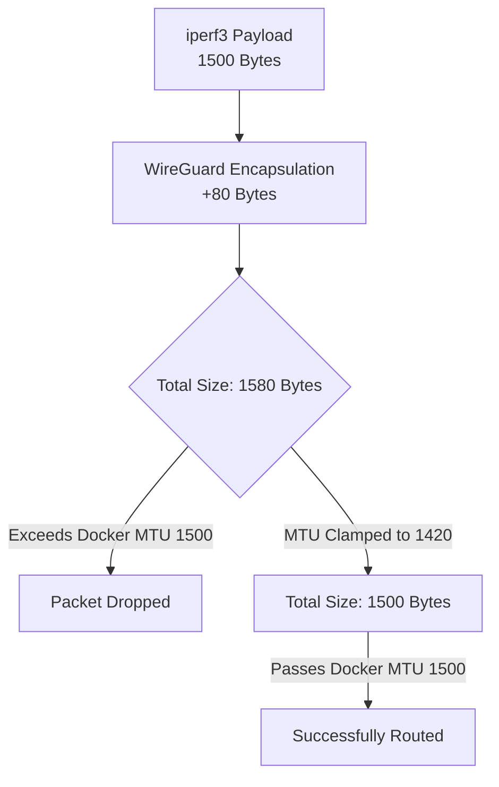
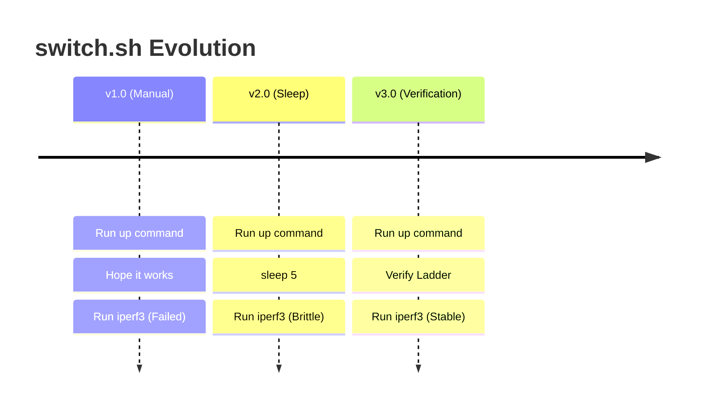

# VPNLens Engineering Postmortem: Challenges and Resolutions

## Introduction

Every non-trivial engineering project encounters unexpected problems. When reading polished documentation or reviewing a clean codebase, it is easy to assume the development process was a linear journey from conception to deployment. In reality, systems engineering is an iterative process of failure, investigation, and redesign.

VPNLens intentionally documents these issues to preserve the engineering reasoning behind the final implementation. Documenting failures is incredibly valuable; the solutions implemented in the codebase (such as exponential backoffs, MTU clamping, and strict state verification) only make sense when you understand the catastrophic failures they were designed to prevent. This postmortem serves as a historical record of the platform's maturation.

---

## Challenge Format

To maintain consistency and provide clear engineering value, every major challenge documented in this postmortem adheres to the following structured analytical format:

1.  **Context:** The operational environment and the goal we were trying to achieve.
2.  **Problem:** The specific technical roadblock encountered.
3.  **Symptoms:** How the failure manifested in the system.
4.  **Investigation:** The debugging steps taken to isolate the issue.
5.  **Root Cause:** The fundamental technical reason for the failure.
6.  **Solution:** The architectural or code-level fix implemented.
7.  **Lessons Learned:** The broader engineering takeaway.

---

## Cloud Infrastructure Challenges

### OCI Virtual Cloud Network (VCN) Ingress Rules

**Context:** We deployed the VPNLens Control Plane on Oracle Cloud Infrastructure (OCI) running Ubuntu LTS. We needed to expose WireGuard and Headscale to the public internet.
**Problem:** The VPN clients on the Benchmark Node could not establish a handshake with the Control Plane.
**Symptoms:** `wg show` on the client displayed sent handshakes but zero received handshakes. Pings across the tunnel timed out.
**Investigation:** We verified the `wg-easy` container was running and listening on UDP 51820. We checked the local Ubuntu firewall (`ufw status`) and confirmed port 51820 was open. We then ran `tcpdump` on the host and saw no incoming UDP traffic.
**Root Cause:** OCI utilizes a Virtual Cloud Network (VCN) with independent Security Lists that supersede the OS-level firewall. By default, OCI blocks all ingress traffic except SSH (TCP 22). Opening `ufw` on Ubuntu is insufficient if the OCI hypervisor drops the packets before they reach the VM.
**Solution:** We manually configured the OCI VCN Default Security List to explicitly allow ingress UDP traffic on port 51820 and TCP traffic on ports 80/443.
**Lessons Learned:** Cloud networking operates in layers. Host-level firewalls (`iptables`/`ufw`) are meaningless if the cloud provider's physical infrastructure is dropping the packets.

---

## Docker Challenges

### The MTU Fragmentation Blackhole

**Context:** The entire Control Plane, including the `wg-easy` WireGuard endpoint, is containerized via Docker.
**Problem:** The VPN tunnel connected successfully, but bandwidth throughput was abysmal or completely stalled.
**Symptoms:** `ping` requests succeeded (showing low latency). However, running `iperf3` resulted in `0 Mbps` or stalled indefinitely.
**Investigation:** We knew the cryptographic keys were correct because ICMP echo requests were routing. The issue only occurred with large TCP payloads. We utilized `tcpdump` to inspect the traffic during an `iperf3` run and observed massive packet fragmentation and dropped frames.
**Root Cause:** Docker's default bridge network assigns an MTU (Maximum Transmission Unit) of 1500 bytes. The physical OCI NIC also uses an MTU of 1500. WireGuard adds 80 bytes of cryptographic encapsulation header to every packet. When a 1500-byte payload entered the WireGuard tunnel, it became a 1580-byte packet. The Docker network and the physical NIC rejected this oversized packet, silently dropping it.



**Solution:** We explicitly clamped the MTU of the WireGuard interfaces in both the server `docker-compose.yml` and the client configurations to `1420`.
**Lessons Learned:** Overlay networks create a "network within a network." You must calculate cryptographic header overhead to prevent silent packet drops.

---

## Reverse Proxy Challenges

### TLS Termination and Subdomain Routing

**Context:** We needed to securely expose the React frontend, Node.js API, `wg-easy` dashboard, and Headscale control API using distinct subdomains.
**Problem:** Managing SSL/TLS certificates for four separate subdomains using Nginx and `certbot` became an operational nightmare, frequently resulting in failed automated renewals.
**Symptoms:** Browsers threw `NET::ERR_CERT_DATE_INVALID` errors. The frontend could not communicate with the backend due to mixed-content (HTTP/HTTPS) policies.
**Investigation:** The Nginx configurations were overly complex, requiring manual cron jobs for `certbot`. When a container restarted, the Let's Encrypt challenge often failed due to race conditions.
**Root Cause:** Nginx is not natively designed for automated ACME challenges out-of-the-box; it requires secondary sidecar containers and complex volume mounts to share certificates.
**Solution:** We ripped out Nginx and migrated the entire reverse proxy layer to Caddy. Caddy natively handles Let's Encrypt provisioning and renewals without any external tools. The routing logic for four subdomains was reduced to a 10-line `Caddyfile`.
**Lessons Learned:** In modern infrastructure, choose tools that automate security by default. Caddy traded minor performance optimizations for massive gains in operational simplicity.

---

## WireGuard Challenges

### Host IP Forwarding

**Context:** Deploying the WireGuard server via the `wg-easy` Docker container.
**Problem:** Clients could connect to the VPN but could not route traffic to the internet or other containers on the Control Plane.
**Symptoms:** Tunnel is up, `wg show` displays data transfer, but `ping 8.8.8.8` or `curl <internal-api-ip>` from the Benchmark Node fails.
**Investigation:** We verified Docker networking. The packets were successfully reaching the `wg-easy` container, but the container was dropping them instead of forwarding them to the destination.
**Root Cause:** The Linux kernel explicitly disables IP forwarding by default for security reasons. A VPN server fundamentally acts as a router; it must be allowed to forward packets from one network interface (the `wg0` tunnel) to another (the `eth0` physical interface).
**Solution:** We modified the host server's `/etc/sysctl.conf` to set `net.ipv4.ip_forward=1` and applied the changes using `sysctl -p`.
**Lessons Learned:** Containerized networking still relies entirely on the host kernel's routing policies.

---

## Headscale Challenges

### Headless Client Registration

**Context:** Automating the benchmarking of Headscale (Tailscale).
**Problem:** During the automated `switch.sh` execution, the Tailscale client would hang indefinitely when attempting to bring the interface up.
**Symptoms:** The bash script halted. Manual inspection of the logs showed Tailscale outputting: `To authenticate, visit: https://hs.vpnlens.samay15jan.com/register/...`
**Investigation:** WireGuard is static; you supply keys, and it routes. Tailscale utilizes a centralized control plane. By default, joining a Tailscale network requires a human to click a link in a web browser and authorize the node.
**Root Cause:** The interactive authentication flow is fundamentally incompatible with headless automation.
**Solution:** We transitioned to using Headscale Pre-Auth Keys. We generated a reusable, non-expiring authentication token on the control plane. The automation script was updated to execute `tailscale up --authkey=$TS_KEY`, bypassing the interactive web flow entirely.
**Lessons Learned:** Authentication mechanisms designed for human UI interactions break headless infrastructure. Service-to-service communication must rely on machine tokens.

---

## Running Two VPN Technologies

### Routing Table Collisions

**Context:** The Benchmark Node evaluates both WireGuard and Headscale sequentially.
**Problem:** WireGuard would benchmark perfectly, but when the script switched to Headscale, the Headscale benchmark would fail, or vice versa.
**Symptoms:** The second protocol in the queue would fail to establish a route to the Control Plane.
**Investigation:** We paused the automation script mid-execution and manually ran `ip route`. We discovered lingering policy routing rules and `wg0` interfaces that had not been cleanly destroyed.
**Root Cause:** `tailscaled` and `wg-quick` aggressively manipulate the host's `iptables` and routing tables. If WireGuard is active, and Tailscale is started without cleanly shutting WireGuard down, the kernel routing table contains conflicting default routes for the overlay networks.
**Solution:** We completely redesigned the `switch.sh` script to enforce a "Stop Everything" phase. Before *any* VPN is brought up, the script explicitly runs `wg-quick down`, `tailscale down`, and `systemctl stop tailscaled`, regardless of what is currently active.
**Lessons Learned:** You cannot trust the OS to clean up after a VPN. State management scripts must be aggressive and idempotent.

---

## `switch.sh` Evolution

### The Verification Ladder

**Context:** Orchestrating the network state on the Benchmark Node.
**Problem:** Benchmarks were occasionally returning `0 Mbps` for throughput.
**Symptoms:** The script executed perfectly, but the `iperf3` JSON payload showed failed connections.
**Investigation:** We added verbose logging to `run-benchmark.sh`. We discovered that `iperf3` was executing *milliseconds* after the `tailscale up` command.
**Root Cause:** Network interfaces do not establish instantaneously. While the local command returns immediately, the cryptographic handshake, DHCP assignment, and NAT traversal take several seconds. The script was testing the tunnel before the tunnel existed.
**Solution:** We implemented the Verification Ladder in `switch.sh`. The script now sequentially verifies:

1. Interface Exists (`ip link`)
2. IP Assigned (`ip addr`)
3. Route Available (`ip route`)
4. Connectivity (`ping`)
5. Backend Reachable (`curl`)



**Lessons Learned:** Never assume a command's successful exit code means the asynchronous system state is ready. Verify the physical reality of the network before testing it.

---

## Benchmark Automation Challenges

### The Observer Effect

**Context:** Collecting metrics via `run-benchmark.sh`.
**Problem:** WireGuard throughput on the Benchmark Node was fluctuating wildly between consecutive test runs (e.g., 800 Mbps down to 400 Mbps).
**Symptoms:** Inconsistent data. The CPU metrics on the server were unexpectedly high during the slower runs.
**Investigation:** We realized the throughput was only dropping when an engineer had a live SSH session open, watching the script execute using `top`.
**Root Cause:** Cryptography is highly CPU-bound. When `iperf3` saturated the CPU, the SSH daemon was simultaneously attempting to encrypt and transmit the rapidly updating terminal output (from `top`) back to the engineer's laptop. The SSH process was stealing CPU cycles from the `wireguard-linux` kernel module, throttling the VPN's throughput.
**Solution:** We enforced strictly headless execution. The Node.js backend triggers the script via SSH but suppresses all standard output during the run.
**Lessons Learned:** In systems benchmarking, the tools used to observe the system alter the performance of the system (The Observer Effect).

---

## Backend Challenges

### SSH Timeouts During Saturated Tests

**Context:** The Node.js backend uses the `ssh2` library to trigger `run.sh` on the Benchmark Node.
**Problem:** The backend job queue would occasionally freeze, leaving jobs permanently stuck in the `RUNNING` state.
**Symptoms:** The Node.js application showed no errors, but the SSH connection dropped, and the `POST /api/results` payload never arrived.
**Investigation:** We cross-referenced the backend logs with the Benchmark Node's system logs. We found that during the `iperf3` UDP maximum bandwidth tests, the NIC became so saturated that the SSH keepalive packets were dropped, causing the backend to silently sever the connection.
**Root Cause:** Relying on a continuous, unbroken SSH session over a network interface that is actively being stress-tested to its breaking point is a flawed architecture.
**Solution:** We decoupled the execution. The Node.js backend now initiates the script via SSH but does *not* wait for it to finish over SSH. The bash script runs independently and is responsible for making a `curl POST` back to the API. We also implemented a strict timeout on the backend queue; if a `POST` is not received within 10 minutes, the backend assumes failure, marks the job as `FAILED`, and unlocks the queue.
**Lessons Learned:** Never trust a synchronous connection during an infrastructure stress test. Utilize asynchronous callbacks and strict timeouts.

---

## Dashboard Challenges

### Synchronous Waiting and Browser Timeouts

**Context:** The React frontend user experience.
**Problem:** Users would click "Run Benchmark" and stare at a loading spinner for 10 minutes.
**Symptoms:** Users would navigate away, refresh the page, or the reverse proxy would drop the connection due to HTTP timeouts, resulting in lost data visibility.
**Investigation:** A full suite of tests (ping, upload, download, CPU profiling, recovery) across two protocols takes significant time. HTTP requests are not designed for 10-minute lifecycles.
**Root Cause:** The architecture was forcing a synchronous web pattern onto an asynchronous infrastructure workload.
**Solution:** We overhauled the workflow. The API now returns a `202 Accepted` immediately. We integrated the Resend API. When the benchmark finishes, the backend dynamically generates a unique URL and emails it to the user.
**Lessons Learned:** Align the user experience with the physical realities of the backend infrastructure. Long-running jobs require asynchronous notification.

---

## GitHub Actions

### Multi-Architecture Builds

**Context:** Automating the deployment of the Node.js backend image.
**Problem:** The Docker image built by GitHub Actions would fail to run on the OCI production server.
**Symptoms:** Docker logs on the server displayed `exec format error`.
**Investigation:** We verified the code compiled locally. We checked the architecture of the GitHub Actions runner and the OCI server.
**Root Cause:** GitHub Actions runners typically use x86_64 (AMD64) architecture. The OCI Ampere instances utilize ARM64 architecture. Building a standard image on x86 and deploying it to ARM results in a binary architecture mismatch.
**Solution:** We updated the GitHub Actions workflow to utilize Docker Buildx, explicitly compiling multi-architecture images (`linux/amd64`, `linux/arm64`) before pushing to the registry.
**Lessons Learned:** Containerization does not abstract CPU architectures. Build pipelines must explicitly target the production hardware profile.

---

## Project Management Challenges

### Managing Scope Creep

**Context:** Balancing the ambition of a complete infrastructure platform with realistic time constraints.
**Problem:** The project constantly threatened to expand beyond its manageable scope.
**Investigation & Reasoning:**
We initially planned to use **Terraform** to provision the servers and **Ansible** to configure them. We also planned to use **Prometheus** for metric scraping and **WebSockets** for real-time terminal streaming to the dashboard.
As the core challenges of Linux networking and benchmarking accuracy surfaced, we realized that integrating Terraform or Prometheus would distract from the primary objective: building a stable, accurate, automated test engine.

> [!NOTE]
> **Strategic Postponement:** We intentionally postponed Terraform, Ansible, and WebSockets. We traded infrastructure-as-code purity for benchmarking accuracy.

**Lessons Learned:** Delivering a smaller, highly robust core feature set (the bash orchestration and sequential queue) is vastly superior to delivering a sprawling, fragile platform that produces invalid data.

---

## AI-Assisted Development Challenges

**Context:** Utilizing Large Language Models (LLMs) to accelerate development.
**Problem:** Over-reliance on AI generated code that looked syntactically correct but failed logically in a systems engineering context.
**Investigation & Root Cause:**
AI was exceptionally good at generating boilerplate Express routes, React component structures, and raw SQL schemas. However, it hallucinated disastrously when dealing with low-level Linux networking.
For example, when asking an AI to write the `switch.sh` teardown logic, it frequently hallucinated `iproute2` flags or suggested restarting the entire `systemd-networkd` service, which would completely sever the server's public SSH connection.
**Solution:** We established a strict workflow. AI was used for *implementation* (syntax translation), but *architecture* and *validation* remained strictly human.

1. Human defines the architecture.
2. AI writes the function.
3. Human deploys, tests, debugs the inevitable kernel error, and refines the code.
**Lessons Learned:** AI accelerates coding, but it does not accelerate engineering decision-making. AI cannot perform deep packet inspection via `tcpdump` to find an MTU fragmentation issue. Systems engineering remains a human discipline.

---

## Biggest Lessons

* **Linux Networking:** Is stateful, messy, and requires aggressive, explicit management. You cannot trust the OS to clean up after a destroyed container.
* **Automation:** Requires extreme paranoia. Defensive programming (`set -e`, strict trapping, Verification Ladders) is the only way to build reliable infrastructure scripts.
* **Benchmarking:** The observer effect is real. You must mathematically isolate the test environment from the control environment.
* **Architecture:** Simplicity scales. Embedded SQLite and standard SSH orchestration outperformed complex distributed databases and custom agent APIs by eliminating points of failure.
* **Documentation:** Documenting failures provides infinitely more engineering value than only documenting successes.

---

## Advice to Future Contributors

If you are joining the VPNLens project, keep these principles in mind:

1. **Read the Architecture First:** Do not attempt to modify the React frontend without understanding that it relies on an asynchronous backend queue.
2. **Understand the Workflow:** The bash scripts on Server 2 are the heart of the project. Understand the Verification Ladder before altering `switch.sh`.
3. **Treat Infrastructure as Code:** Do not manually install packages on the production servers. If a dependency is required, add it to the Dockerfile.
4. **Verify Before Optimizing:** If you write a faster way to parse JSON in bash, verify that it handles non-standard `iperf3` exit codes gracefully before pushing it to production.

---

## Conclusion

VPNLens became a significantly stronger, more resilient platform precisely *because* of these challenges. The process of fighting Docker MTU limits, diagnosing SSH observer effects, and stabilizing volatile Linux routing tables forced the project to evolve from a fragile script into a robust automation engine.

The most valuable outcome of this project was not the final benchmark data comparing WireGuard to Headscale. The most valuable outcome was the engineering process itself—the maturation required to design, debug, and automate a complete distributed system.

```

```