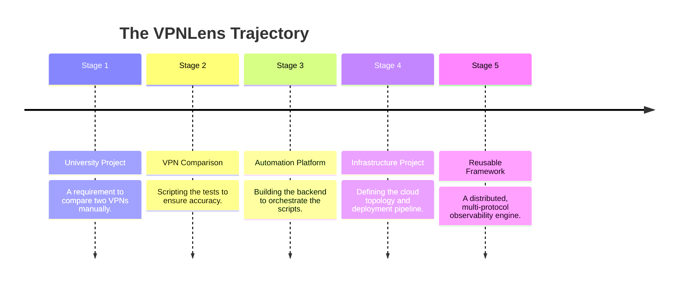

# VPNLens: Strategic Engineering Roadmap and Future Vision

## Introduction

VPNLens is currently functionally complete as a prototype. It successfully accomplishes its initial objective: automating the deployment, execution, and metric collection of Virtual Private Network (VPN) benchmarks on cloud infrastructure. However, the architecture of VPNLens was intentionally designed with strict modularity, decoupling state management from metric collection and the control plane from the execution environment.

This decoupling ensures that VPNLens is not a rigid, one-time academic exercise. It is an extensible framework. This document outlines the strategic engineering roadmap and long-term vision for the project. It details how the platform will evolve from a localized benchmarking tool into a distributed, multi-cloud, multi-protocol infrastructure observability platform.

This is not a feature wishlist. Every objective detailed below represents a deliberate engineering progression that naturally extends the existing architecture, addressing known limitations and expanding the platform's utility for DevOps and Platform Engineers.

---

## Current Status

Before charting the future, it is necessary to establish the current baseline. VPNLens v1.0 has successfully implemented a complete end-to-end benchmarking pipeline.

**Completed Capabilities:**

* **React Dashboard:** A functional Single Page Application (SPA) for job submission and data visualization.
* **Node.js Backend:** An asynchronous API layer managing a First-In-First-Out (FIFO) benchmark queue.
* **SQLite Database:** Persistent, file-based relational storage for benchmark requests and results.
* **Protocol Support:** Automated state management and evaluation for WireGuard and Headscale (Tailscale).
* **Containerization:** Full Docker and Docker Compose definitions for the Control Plane.
* **Reverse Proxy:** Automated TLS termination and subdomain routing via Caddy.
* **Email Reports:** Asynchronous delivery of benchmark results via the Resend API.
* **Unique Result URLs:** Cryptographically secure, permanent links to specific benchmark runs.
* **CI/CD Pipeline:** GitHub Actions for automated Docker image builds and registry publishing.
* **Automated Benchmark Scripts:** Modular bash orchestration (`run.sh`, `switch.sh`, `run-benchmark.sh`) featuring a strict Verification Ladder and retry logic.
* **Benchmark History:** Tabular, paginated history of all executed runs.

---

## Short-Term Roadmap

The immediate focus (v1.1) is technical debt reduction, repository stabilization, and improving the observability of the platform itself.

### Priorities

* **Documentation and Final Report:** Completing the foundational documentation (including this roadmap, architectural guides, and methodology) to ensure future maintainers understand the *why* alongside the *what*. Integration of the academic Final Report PDFs.
* **Repository Cleanup:** Standardizing linting rules (ESLint/Prettier), removing unused frontend dependencies, and ensuring strict type-checking on backend API payloads.
* **Better Charts:** Upgrading the React charting components to support zoomable time-series data, allowing users to inspect the exact moment CPU utilization spiked during a throughput test.
* **Improved Analysis:** Adding calculated delta percentages to the dashboard (e.g., "WireGuard achieved 34% higher throughput than Headscale with 12% lower CPU overhead").
* **Additional Screenshots:** Populating the documentation and the `README.md` with high-resolution visual evidence of the platform in action.
* **Better Error Handling:** Enhancing the backend's ability to gracefully recover if a bash script exits with an unhandled signal (e.g., `SIGKILL` due to Out-Of-Memory errors on the Benchmark Node).
* **Improved Logging:** Standardizing the output format of `switch.sh` to produce JSON-structured logs locally on the Benchmark Node, making it easier to ingest into standard log aggregators (like ELK or Loki) in the future.

**Why this matters:** A project cannot scale if its foundation is difficult to debug or poorly documented. Stabilizing the codebase ensures that when open-source contributors arrive, they are greeted by a mature, predictable environment.

---

## Medium-Term Roadmap

The medium-term vision (v1.5) focuses heavily on Infrastructure as Code (IaC) and lifecycle automation. Currently, Server 1 and Server 2 must be manually provisioned in the cloud provider's console. This violates the principle of total reproducibility.

### Priorities

* **Terraform Integration:** Writing Terraform modules to define the Oracle Cloud Infrastructure (OCI) Virtual Cloud Networks (VCNs), subnets, security lists, and compute instances. This will allow the entire environment to be deployed with `terraform apply`.
* **Ansible Configuration:** Replacing manual dependency installation (e.g., `apt-get install iperf3 tailscale wireguard-tools`) on the Benchmark Node with idempotent Ansible playbooks.
* **Automatic Provisioning:** Linking Terraform to the Node.js backend. Instead of relying on a static Server 2, the backend will use cloud provider APIs to automatically provision a benchmark node when a job is requested.
* **Destroy and Rebuild Infrastructure:** The logical conclusion of automated provisioning. Once a benchmark finishes, the backend will destroy the ephemeral Benchmark Node. This guarantees a mathematically pristine, zero-drift kernel state for every single benchmark execution, while significantly reducing cloud compute costs.
* **Configuration Templating:** Using Jinja2 or similar templating engines to dynamically generate `Caddyfile` and `docker-compose.yml` configurations based on the deployment environment.
* **Environment Management:** Creating distinct `.env` profiles for `development`, `staging`, and `production` to separate local testing from live cloud deployments securely.

**Why this matters:** True benchmarking reproducibility requires infrastructure reproducibility. If a researcher wants to validate VPNLens's claims, they must be able to spin up the exact same physical and virtual topology. IaC makes this possible.

---

## Long-Term Roadmap

The long-term vision (v2.0+) transforms VPNLens from a point-to-point testing tool into a distributed, multi-cloud network observability framework.

### Priorities

* **Multiple Benchmark Nodes:** Modifying the backend queue to support a distributed fleet of worker nodes. This will allow the platform to simulate massive concurrency, measuring how a VPN control plane handles hundreds of simultaneous cryptographic handshakes.
* **Multiple Cloud Providers:** Abstracting the Terraform modules to support AWS, Azure, DigitalOcean, and Hetzner.
* **Multi-Region Testing:** Deploying the Control Plane in `us-east-1` (AWS) and Benchmark Nodes in `eu-central-1` (AWS) and `fra1` (Hetzner) to evaluate inter-cloud overlay routing, MTU fragmentation across differing provider backbones, and real-world geographic latency constraints.
* **Historical Benchmarking & Trend Analysis:** Automating the execution of benchmarks on a schedule (e.g., every 6 hours) to map a cloud provider's macro network congestion patterns over months, identifying "noisy neighbor" degradation.
* **Plugin Architecture for Additional VPNs:** Refactoring `switch.sh` into a modular plugin system. This will allow contributors to easily add support for:
* **OpenVPN:** The legacy enterprise standard.
* **IPsec (StrongSwan):** The kernel-space enterprise standard.
* **Netbird & Nebula:** Modern competitors in the peer-to-peer mesh space.
* **OpenZiti:** Evaluating zero-trust overlay networks.
* **Tinc:** The classic mesh VPN daemon.

**Why this matters:** The cloud is not homogenous, and enterprise networks rarely rely on a single protocol. By distributing the benchmarking nodes geographically and across providers, VPNLens will provide enterprise architects with the data necessary to select the correct VPN topology for multi-cloud deployments.

---

## Dashboard Evolution

As the backend collects more complex datasets, the React frontend must evolve to interpret them.

### Priorities

* **Advanced Analytics & Historical Graphs:** Moving beyond isolated run reports. The dashboard must plot the historical performance of WireGuard over the last 90 days, visualizing variations in latency and throughput across multiple identical runs.
* **Benchmark Comparison Engine:** A dedicated UI view allowing a user to select two disparate benchmark IDs and generate a side-by-side graphical diff of their performance metrics.
* **Data Export (PDF & CSV):** Infrastructure decisions require documentation. The dashboard will support exporting raw CSV data for external analysis in Python/Jupyter, and generating polished PDF executive summaries.
* **Interactive Topology:** A dynamic visualizer that updates based on the active test scenario (e.g., showing a node in AWS communicating with a node in OCI over a Headscale tunnel).

### Intentionally Postponed Features

* **Live Monitoring & WebSockets:** Streaming the raw `stdout` of the Benchmark Node to the dashboard via WebSockets sounds appealing. However, it introduces significant fragility. Maintaining persistent WebSocket connections over mobile networks during 10-minute infrastructure stress tests often leads to timeouts. We are explicitly prioritizing reliable, asynchronous email delivery over fragile, real-time UI updates.

---

## Backend Evolution

To support distributed, multi-node testing, the Orchestration Layer must scale.

### Priorities

* **Worker Queues & Background Jobs:** The native Node.js array-based queue is sufficient for a single Benchmark Node. To support multiple nodes, the backend will migrate to a robust, Redis-backed message broker (such as BullMQ or Celery). This provides automatic job retries, priority queuing, and persistence across backend restarts.
* **Authentication & Authorization:** Currently, the dashboard is open. Exposing a platform that can trigger high-compute workloads (and incur cloud costs) to the public internet is dangerous at scale. We will implement JSON Web Tokens (JWT) for dashboard access and Role-Based Access Control (RBAC).
* **API Keys:** Implementing programmatic access. Users will be able to generate API keys to trigger benchmarks via standard `curl` commands from their own CI/CD pipelines, completely bypassing the React UI.
* **Database Migration (PostgreSQL):** SQLite is perfect for strictly sequential, single-node writes. However, if multiple Benchmark Nodes are POSTing metrics simultaneously, SQLite will encounter write-lock contention. The backend (currently utilizing an ORM) will be migrated to PostgreSQL to support high-concurrency writes and complex analytical queries.

**Why this matters:** Scaling the execution layer requires scaling the control layer. Migrating to Redis and PostgreSQL trades operational simplicity (our current priority) for horizontal scalability (our future requirement).

---

## Infrastructure Evolution

The evolution of the deployment model focuses on removing manual operations and establishing CI/CD supremacy.

### Priorities

* **Self-Hosted Runners:** Currently, GitHub Actions uses shared cloud runners. We will deploy self-hosted GitHub Actions runners directly within our cloud environments. This allows the CI/CD pipeline to interact securely with our internal Terraform state files without exposing cloud credentials to external build environments.
* **Automated Staging Deployments:** Every pull request will automatically trigger a deployment to a temporary, isolated staging URL, allowing maintainers to physically test UI and API changes before merging them into `main`.
* **Multi-Server Parity:** Guaranteeing that the Docker Compose configurations and environment variables load identically regardless of whether the target host is an OCI Ampere instance or an AWS EC2 x86 instance.

---

## Benchmarking Evolution

The tests themselves must become more rigorous to uncover edge-case protocol failures.

### Priorities

* **Long-Duration Tests:** Current tests run for approximately 60 seconds. We will introduce 24-hour and 72-hour stress tests to identify memory leaks in userspace networking agents (like `wireguard-go`) and thermal throttling in the underlying cloud hardware.
* **Jitter Analysis:** High-frequency UDP packet transmission to accurately measure latency variance (jitter), which is critical for evaluating a VPN's suitability for VoIP and video conferencing.
* **MTU Analysis:** Automated path MTU discovery tests to dynamically measure how different VPN protocols handle packet fragmentation across complex cloud transit routes.
* **Connection Stability Under Chaos:** Utilizing tools like `tc` (Traffic Control) to artificially introduce packet loss, latency, and corruption on the host OS, observing how gracefully the VPN protocols recover from severe network degradation.

**Why this matters:** Anyone can achieve high throughput on a perfectly pristine cloud network. The true test of an enterprise network overlay is how it behaves when the underlying physical network is actively failing.

---

## Open Source Goals

VPNLens is designed to be an asset to the open-source infrastructure community. Cultivating that community requires explicit effort.

### Priorities

* **Contribution Guidelines:** Publishing a comprehensive `CONTRIBUTING.md` that explicitly details how to set up a local development environment, how to mock the SSH execution layer for local API testing, and the coding standards required.
* **Issue and PR Templates:** Standardizing bug reports to ensure contributors provide kernel versions, Docker versions, and raw `iperf3` logs when submitting issues.
* **Public Benchmark Datasets:** Releasing the aggregated SQLite databases periodically as open datasets, allowing academic researchers and network engineers to analyze the historical performance deltas between kernel and userspace VPNs without having to run the infrastructure themselves.
* **Educational Value:** Maintaining the codebase as a primary example of how to securely orchestrate Linux bash scripts via Node.js SSH clients.

---

## Engineering Vision

The most critical aspect of this roadmap is understanding the trajectory of the project.

VPNLens was initially conceived to answer a single question: *"Is WireGuard faster than Headscale?"*

During development, we realized that the tool we were building to answer that question was significantly more valuable than the answer itself. Throughput numbers change every time a cloud provider upgrades a CPU or alters a hypervisor. The absolute numbers are ephemeral. **The methodology is permanent.**

The long-term engineering vision is to establish VPNLens as the standard open-source framework for deterministic network overlay evaluation. It is designed to be the tool that Platform Engineers reach for when they need to empirically prove to their stakeholders which VPN architecture will best serve their specific multi-cloud environment.

---

## Milestones

The following table outlines the strategic milestones that map the trajectory from the current state to the long-term vision.

| Version | Status | Focus Area | Major Features |
| --- | --- | --- | --- |
| **v1.0** | **Completed** | **Core Automation** | Two-server architecture, SQLite, Dockerized Control Plane, Caddy reverse proxy, sequential backend queue, Resend asynchronous email delivery, automated execution of WireGuard and Headscale via `switch.sh`. |
| **v1.1** | **Planned** | **Stabilization** | Comprehensive engineering documentation, repository cleanup, advanced React charting UI, structured JSON logging on the Benchmark Node, robust backend error trapping. |
| **v1.5** | **Planned** | **Infrastructure as Code** | Terraform OCI provisioning, Ansible dependency management, ephemeral benchmark node lifecycle (deploy, test, destroy), `.env` templating, self-hosted CI/CD runners. |
| **v2.0** | **Vision** | **Distributed Framework** | Redis worker queues, PostgreSQL migration, JWT Authentication, API Key generation, Multi-cloud support (AWS, Azure), Plugin architecture for OpenVPN/IPsec, 24-hour stress testing, advanced analytical dashboard comparisons. |

---

## Conclusion

The evolution of VPNLens demonstrates a fundamental truth of systems engineering: solving a highly specific problem (manually comparing two VPNs) often requires building a generalized, robust platform.

This roadmap charts a course for sustainable evolution. By prioritizing Infrastructure as Code, distributed worker queues, and rigorous chaos testing, VPNLens will continue to grow beyond its academic origins. It will transition from a prototype into a hardened, highly extensible framework capable of navigating the complexities of modern multi-cloud network evaluation. The foundation is built; the architecture is modular; the future is automated.