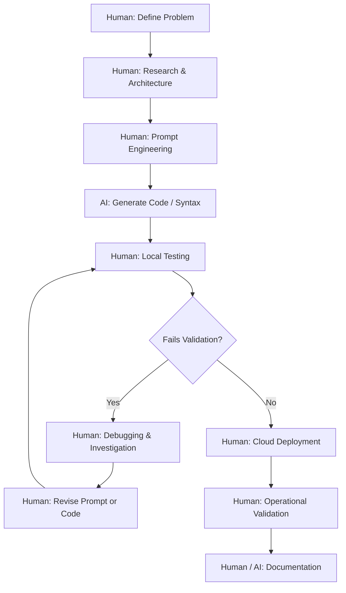

# VPNLens: Acknowledgements and Ecosystem

## Introduction

Modern systems engineering is fundamentally collaborative. A platform like VPNLens—which orchestrates cloud compute instances, manipulates Linux kernel networking, and serves real-time analytics—is not the product of a single technology or a solitary effort. It stands on decades of foundational work from the Linux ecosystem, the dedication of open-source maintainers, academic research, and the evolution of modern developer tooling.

This final document acknowledges the technologies, communities, academic environments, and artificial intelligence tools that made the development of this platform possible. It serves as a transparent record of the ecosystem required to build, automate, and document an end-to-end benchmarking system.

---

## The Open Source Community

VPNLens is assembled almost entirely from open-source software. The platform exists because thousands of engineers worldwide have committed their time to building robust, accessible technologies.

The following projects formed the foundation of the VPNLens architecture:

| Technology | Role and Contribution |
| --- | --- |
| **Linux (Ubuntu)** | The foundational operating system. Its robust networking stack, `iproute2` utilities, and kernel capabilities provided the necessary environment for advanced overlay routing and metric sampling. |
| **Docker & Compose** | Enabled the containerization of the Control Plane. Docker ensured that the database, reverse proxy, and backend API could be deployed deterministically, isolating dependencies and eliminating environmental configuration drift. |
| **WireGuard** | Provided the baseline for kernel-space cryptographic tunneling. Its simplicity, stateless architecture, and integration into the Linux kernel (`wireguard-linux`) set the standard for modern VPN performance. |
| **Headscale** | The open-source implementation of the Tailscale control plane. It allowed the project to evaluate a stateful, peer-to-peer mesh architecture without relying on proprietary SaaS infrastructure, ensuring a fair, self-hosted comparison. |
| **Caddy** | Abstracted the complexity of reverse proxying and TLS termination. Caddy’s automatic Let's Encrypt provisioning allowed the secure routing of four distinct subdomains (`vpnlens`, `backend`, `wg`, `hs`) with minimal configuration. |
| **Node.js & Express** | Powered the backend orchestration layer. The asynchronous, non-blocking I/O model of Node.js was ideal for managing the benchmark queue, handling SSH connections, and interacting with the database without stalling. |
| **React & Vite** | Provided the component-based architecture necessary to build the frontend dashboard. Vite facilitated a highly optimized developer experience with rapid module replacement, while React enabled the complex visualization of JSON benchmarking data. |
| **SQLite** | Served as the persistent, relational data store. Its embedded nature eliminated the need for a separate database server, perfectly accommodating the sequential, linear write patterns of the benchmarking queue. |
| **Resend** | Facilitated the asynchronous delivery of benchmark reports. This email infrastructure was critical for decoupling long-running network stress tests from fragile, synchronous web browser sessions. |
| **GitHub & Actions** | Provided version control and CI/CD pipelines. GitHub Actions automated the compilation of React and the generation of multi-architecture Docker images, ensuring reliable deployments to the cloud. |

---

## Oracle Cloud Infrastructure (OCI)

A valid network benchmark cannot be executed on a localized hypervisor or a single laptop. It must traverse genuine internet routing paths, encounter physical MTU constraints, and operate within the confines of cloud hypervisor policies.

Oracle Cloud Infrastructure (OCI) provided the physical compute resources that made this project viable. The availability of OCI’s Ampere (ARM-based) compute instances allowed the deployment of a highly capable, two-server architecture. By running the Control Plane and the Benchmark Node on real cloud servers with public IP addresses, VPNLens was able to evaluate the VPN protocols under realistic, production-grade deployment conditions.

---

## Academic Context

VPNLens originated as a university requirement for an **Internship-I** project. The initial academic directive was to produce a comparative study of centralized versus peer-to-peer VPN architectures.

While the project eventually expanded far beyond the scope of a simple manual comparison, the academic framework provided the initial motivation, the structured deadlines, and the requirement for rigorous documentation (via Weekly Progress Reports).

> [!NOTE]
> The guidance and evaluation provided by the university faculty established the necessary baseline for technical accountability. The transition from a static academic report into a dynamic infrastructure platform was a direct result of attempting to apply rigorous scientific methodology to the initial assignment.

---

## AI-Assisted Development

Modern software development has undergone a paradigm shift with the introduction of Large Language Models (LLMs). It is necessary to document honestly how artificial intelligence was utilized throughout the lifecycle of VPNLens.

Tools such as ChatGPT and Claude were used extensively to accelerate development. They served as highly capable assistants for syntax generation, boilerplate reduction, and documentation formatting.

However, AI accelerated *implementation*; it did not replace *engineering*.

**Areas where AI provided significant acceleration:**

* **Code Generation:** Writing repetitive React component structures, styling layouts, and generating standard Express route handlers.
* **Prompt Engineering:** Translating conceptual logic ("extract the 4th column of this terminal output") into precise bash utilities (`awk`, `sed`, `grep`).
* **Documentation Formatting:** Structuring Markdown files, generating Mermaid diagram syntax from text descriptions, and formatting data into readable tables.
* **Refactoring:** Suggesting cleaner, more idiomatic ways to structure asynchronous JavaScript promises.

**Areas that strictly required human engineering:**

* **Architecture Decisions:** AI cannot design a Two-Server physical isolation model to prevent CPU observer effects. That required human systems analysis.
* **Infrastructure Deployment:** Configuring OCI Virtual Cloud Networks, navigating security lists, and understanding cloud-specific firewall constraints.
* **Networking & Debugging:** Diagnosing Docker MTU fragmentation drops via `tcpdump` required human investigation of network packet headers.
* **Operational Validation:** Determining whether a benchmark was conceptually fair (e.g., implementing the Verification Ladder to ensure tunnels were routing before testing them) relied entirely on human engineering judgment.

### The Iterative AI Workflow

The development process followed a strict, human-driven workflow where AI acted as a functional tool within a broader engineering pipeline.

This workflow emphasizes that generated code was never trusted implicitly. Every script, route, and configuration was subjected to rigorous validation on actual Linux infrastructure.

---

## Lessons About AI

The integration of AI into the development of VPNLens yielded several critical lessons about modern engineering:

1. **AI Increases Productivity:** It dramatically reduces the time spent writing boilerplate, allowing the engineer to spend more time focusing on complex logic and architecture.
2. **AI Helps Explore Alternatives:** It is an excellent tool for discussing architectural trade-offs (e.g., comparing the implementation complexity of Redis queues versus native Node.js arrays).
3. **Verification is Mandatory:** AI frequently hallucinates specific command-line flags or library methods. Blindly executing generated infrastructure code (`iproute2` commands, `iptables` modifications) can permanently corrupt a server's routing table.
4. **Engineering Judgment is Irreplaceable:** AI does not understand the physical constraints of a specific cloud provider's network interface. It can write a script to measure throughput, but the human engineer must ensure the measurement methodology is scientifically valid.

The ultimate lesson is that AI is a force multiplier for a competent engineer, but it is a liability if used as a substitute for foundational systems knowledge.

---

## Open Source Philosophy

VPNLens is published as an open-source project. This aligns with the philosophy that the best way to learn complex systems is by building them, and the best way to advance the industry is by sharing that knowledge transparently.

Comprehensive documentation was intentionally prioritized alongside the codebase.

* **Reproducibility:** A benchmarking platform is only as useful as its ability to be reproduced. The configurations, scripts, and methodologies are open so that independent researchers can validate the findings.
* **Community Learning:** By documenting the challenges, the redesigns, and the failures in the Postmortem and Development History, the project provides educational value beyond its source code. It demonstrates how infrastructure platforms evolve through iteration.

---

## Future Contributors

To the engineers, students, and open-source contributors who encounter this repository in the future:

Your contributions are encouraged. VPNLens is designed to be an extensible framework.

* **Experimentation:** Fork the repository. Break the scripts. Alter the `iperf3` window sizes. See how the network reacts.
* **Enhancements:** Adding support for additional technologies (OpenVPN, IPsec, Nebula) or migrating the manual setup to Terraform are excellent ways to contribute.
* **Thoughtful Engineering:** When contributing, prioritize thoughtful engineering over feature bloat. A stable, reliable orchestration script is vastly more valuable than a fragile new feature. Ensure that any additions respect the core philosophies of isolation, determinism, and reproducibility.

---

## Personal Reflection

The development of VPNLens was a transformative engineering journey. What began as a requirement to manually compare two pieces of software systematically expanded into a deep exploration of distributed systems.

The learning curve was steep. It required bridging the gap between high-level web development (React, Node.js) and low-level Linux systems engineering (`iptables`, kernel namespaces, bash orchestration). It required navigating the complexities of cloud networking, containerized deployments, and asynchronous job queues.

The greatest outcome of VPNLens was not the final benchmark data comparing WireGuard to Headscale. The numbers themselves are ephemeral, bound to change with the next kernel update or cloud hardware revision. The true value was the experience gained by designing, implementing, debugging, and documenting a complete, automated infrastructure platform from scratch. It reinforced the reality that robust systems are not born perfect; they are forged through aggressive testing, failure, and deliberate redesign.

---

## Closing Note

VPNLens began as a university internship project. Through necessity and curiosity, it evolved into a reusable, automated benchmarking platform and a comprehensive study in systems engineering.

It is my hope that this repository, its scripts, and its extensive documentation help other students and engineers demystify cloud infrastructure, understand the mechanics of VPN architectures, and appreciate the rigor required to build reliable automation.

Thank you to the open-source community that provided the tools, the educators who provided the framework, and the developers who continue to push the boundaries of what can be built.