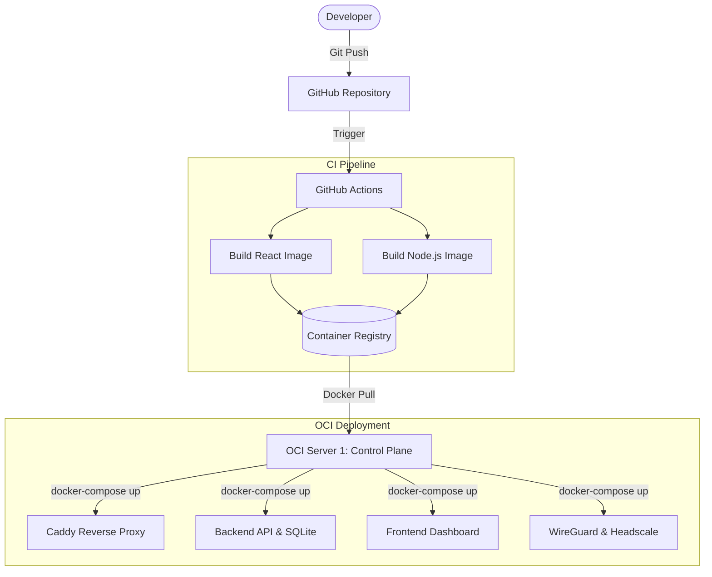
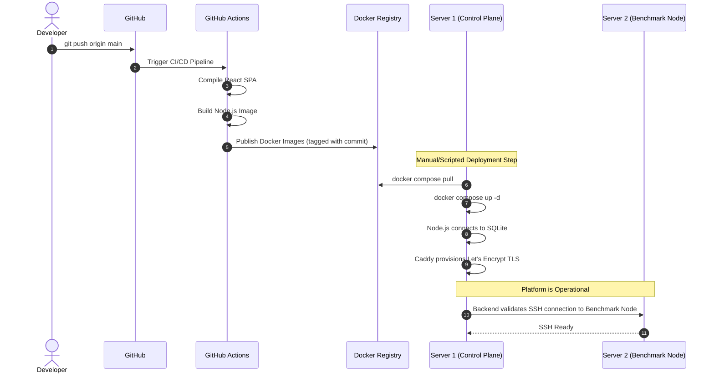

# VPNLens Deployment Guide

## Introduction

The deployment of VPNLens follows a strict infrastructure-first philosophy. Deploying a benchmarking platform is fundamentally different from deploying a standard web application. In a standard web application, the primary goal is uptime and scalability. In VPNLens, the primary goal is **reproducibility and measurement integrity**.

The deployment architecture is heavily containerized to eliminate environment drift. If VPNLens is deployed on an Oracle Cloud Infrastructure (OCI) server today, it must be possible to destroy that server and deploy it again a year from now with the exact same dependencies, kernel configurations, and execution states.

This document outlines the deployment strategy for VPNLens. It explains how the source code transforms into a fully operational, two-server evaluation system. It details the assumptions made about the host operating systems, the order of service initialization, and the reasoning behind these deployment methodologies.

---

## Deployment Overview

The VPNLens deployment pipeline relies on continuous integration principles to move code from a developer's workstation into the OCI production environment.

Rather than compiling code on the production servers—which consumes compute resources and risks leaving orphaned build artifacts—all application builds are offloaded to GitHub Actions. The production deployment consists entirely of pulling immutable Docker images and orchestrating them via Docker Compose.



### Deployment Stages

1. **Source Control:** Changes to the frontend or backend are pushed to the main branch.
2. **CI Compilation:** GitHub Actions spins up an ephemeral runner to execute `npm run build`, packaging the artifacts into isolated Docker images.
3. **Image Registry:** The versioned images are published to a central container registry.
4. **Server Pull:** The Control Plane (Server 1) pulls the latest images.
5. **Orchestration:** Docker Compose maps the networks, persistent volumes, and environment variables required to bring the system online.

---

## Prerequisites

Before the deployment lifecycle can begin, the following foundational components must be established:

* **Oracle Cloud Infrastructure (OCI):** Two separate compute instances are required. They must be provisioned with public IP addresses and placed in Virtual Cloud Networks (VCNs) that permit specific ingress/egress traffic.
* **Ubuntu LTS:** Both instances must run a Long Term Support version of Ubuntu to ensure kernel parity and native `wireguard-linux` support.
* **Docker & Docker Compose:** Required on Server 1 for managing the Control Plane containers.
* **Git & SSH:** Required for repository management and secure machine-to-machine orchestration.
* **Domain Names:** Access to a DNS provider to configure routing for the dashboard, API, and VPN control endpoints.
* **Caddy:** Utilized as the reverse proxy.
* **Resend Account:** An active API key from Resend for the asynchronous email delivery system.
* **GitHub:** For hosting the source code and executing the CI/CD Actions.

---

## Server Preparation

Deployment begins at the operating system level. Before Docker Compose can spin up the application, the host environment must be strictly prepared.

### Updating and Dependencies

The Ubuntu base image is brought up to date, and the Docker engine is installed. This ensures that the container runtime has the latest security patches and networking capabilities.

### Directory Structure

Specific directory structures are created on the host machine to map into the Docker containers. For example, the SQLite database requires a persistent path (e.g., `/opt/vpnlens/data`), and the Caddy proxy requires paths for configuration files and Let's Encrypt certificates.

### SSH Setup

Because Server 1 must orchestrate Server 2 via SSH, an ED25519 keypair is generated on Server 1. The public key is manually injected into the `~/.ssh/authorized_keys` file on Server 2. Password authentication is aggressively disabled on Server 2 to ensure security.

### Firewall Configuration

The host firewall (and the OCI Security Lists) must be configured to allow:

* TCP 80 / 443 (HTTP/HTTPS for Caddy)
* TCP 22 (SSH orchestration)
* UDP 51820 (WireGuard tunnel traffic)
* Custom TCP/UDP ports required by the Headscale control plane.

---

## Domain Configuration

VPNLens relies heavily on domain routing to separate its logical components. A single IP address on Server 1 hosts multiple distinct web services. DNS A-Records must be created pointing to Server 1's public IP address.

* `vpnlens.samay15jan.com`: The primary entry point for users accessing the React dashboard.
* `backend.vpnlens.samay15jan.com`: The dedicated subdomain for the Node.js REST API.
* `wg.vpnlens.samay15jan.com`: The endpoint for the `wg-easy` administrative UI.
* `hs.vpnlens.samay15jan.com`: The control plane endpoint where Tailscale clients register and authenticate.

**Why DNS Separation Matters:**
By separating the services into subdomains, the reverse proxy can cleanly route traffic based on the `Host` header. This allows the backend API to scale or migrate independently of the frontend application in future iterations, without breaking hardcoded paths.

---

## Reverse Proxy Deployment

Caddy acts as the edge gateway for the entire VPNLens platform. It is deployed as a Docker container on Server 1 and binds directly to the host's ports 80 and 443.

### Automatic HTTPS and TLS

Caddy was chosen specifically to eliminate the deployment overhead of managing SSL/TLS certificates. Upon initialization, Caddy parses the `Caddyfile`, identifies the four configured subdomains, and automatically negotiates with Let's Encrypt to provision certificates via the ACME protocol.

### Routing and Service Forwarding

The deployment relies on Docker's internal networking bridge. Caddy is placed on the same Docker network as the frontend, backend, and VPN control panels. When a request arrives at `backend.vpnlens...`, Caddy decrypts the TLS payload and securely proxies the raw HTTP request over the isolated Docker network to the Node.js container on its internal port (e.g., 3000).

This deployment strategy completely shields the internal application ports from the public internet, ensuring that all ingress traffic is forced through the Caddy security layer.

---

## Deploying VPN Services

The core testing targets—WireGuard and Headscale—are deployed as long-running background services on Server 1.

### Deployment Order

The VPN services are brought online *before* the benchmarking API to ensure that if the API receives an immediate benchmark request, the target tunnels are already established and listening.

### WireGuard (`wg-easy`)

`wg-easy` is deployed via Docker Compose. It requires specific Linux capabilities (`CAP_NET_ADMIN` and `CAP_SYS_MODULE`) to interact directly with the host's kernel routing tables.

* **Networking:** It binds UDP 51820 directly to the host to accept incoming encrypted payloads.
* **Persistence:** Its configuration files (containing the generated private/public keys) are mounted to a persistent host volume so that client configurations survive container restarts.

### Headscale

Headscale is deployed to act as the Tailscale coordination server.

* **Configuration:** It requires a heavily customized `config.yaml` injected into the container at startup. This configuration dictates the server URL (`hs.vpnlens.samay15jan.com`) and the database type (local SQLite for Headscale's internal state).
* **Persistence:** The Headscale SQLite database and cryptographic signing keys are mounted to host volumes. Losing these volumes would require re-registering the Benchmark Node client.

---

## Deploying the Backend

The Orchestration Layer (Node.js) connects the user interface to the execution environment.

### Container Setup

The backend is deployed from the immutable image generated by GitHub Actions. It runs inside the shared Docker bridge network.

### Environment Variables

The backend relies entirely on environment variables for configuration. The deployment process involves injecting an `.env` file into the container containing:

* `RESEND_API_KEY`: To authenticate outbound email requests.
* `INTERNAL_NODE_TOKEN`: A pre-shared key used to authenticate inbound POST requests from the Benchmark Node.
* `FRONTEND_URL`: For configuring CORS policies.

### SSH Access

For the backend to orchestrate Server 2, it requires access to the SSH private key generated during the Server Preparation phase. This key is mounted into the Node.js container as a read-only volume, allowing the backend application to initiate connections to the Benchmark Node without relying on a password.

### SQLite Database

The main application database is deployed simply by mounting a persistent host directory to the container path where the Node.js ORM expects to find the `database.sqlite` file. If the file does not exist during initial deployment, the backend's startup script automatically runs the schema migrations to create the required tables.

---

## Deploying the Frontend

The React frontend is deployed as a static Single Page Application (SPA).

### Production Build

During the GitHub Actions CI pipeline, Vite compiles the React components into optimized, minified HTML, CSS, and JavaScript files.

### Serving through Caddy

Unlike the backend, the frontend does not require a running Node.js process in production. The deployment strategy involves placing these static files into a dedicated Docker volume. Caddy is then configured as a static file server for the `vpnlens...` subdomain, reading directly from this volume.

This approach minimizes RAM usage on Server 1, as there is no unnecessary JavaScript runtime required merely to serve static assets. Environment variables (like the backend API URL) are injected during the Vite build phase in the CI pipeline.

---

## Benchmark Node Deployment

Server 2 is intentionally stripped down. The deployment strategy here is based on aggressive minimalism.

### Dependencies

Server 2 requires manual installation of the target testing binaries: `wireguard-tools`, `tailscale`, and `iperf3`.

### SSH Connectivity

The node must be accessible via SSH strictly from Server 1's public IP address, utilizing the ED25519 key pair.

### Benchmark Scripts

The core automation scripts (`run.sh`, `switch.sh`, `run-benchmark.sh`) are copied from the repository into a dedicated execution directory (e.g., `/opt/vpnlens/scripts`).

### Why this server contains no web services

No Docker daemon, no reverse proxy, and no Node.js APIs are deployed on Server 2. The deployment explicitly forbids these services to prevent the "Observer Effect." If Server 2 were to host a web server, incoming HTTP requests would generate CPU interrupts, polluting the system metrics during an active `iperf3` execution. The deployment guarantees that Server 2's kernel is completely dedicated to the VPN routing stack.

---

## GitHub Actions

The deployment strategy relies on GitHub Actions to remove human error from the build process.

### Continuous Integration and Builds

When code is merged into the repository, the GitHub Actions runner automatically provisions an Ubuntu environment, checks out the code, and initiates `docker build`.

### Image Publishing and Versioning

The compiled images are tagged with the Git commit hash and published to a central container registry. This guarantees that the deployed images are strictly versioned. If a new deployment introduces a critical bug, the infrastructure engineer can effortlessly revert the `docker-compose.yml` to pull the previous commit hash, immediately rolling back the platform to a known-stable state.

---


## Benchmark Node Setup

The benchmark node is responsible for connecting to both VPN solutions and executing the benchmarking scripts. It requires both WireGuard and Tailscale (Headscale).

## Prerequisites

```bash
sudo apt update
sudo apt install wireguard-tools resolvconf iperf3 -y
````

---

## WireGuard Client Setup

Copy your client configuration to the default WireGuard location.

```bash
sudo cp <CONFIG>.conf /etc/wireguard/wg0.conf
```

> [!WARNING]
> If you are connected to this machine over SSH, enabling a full-tunnel WireGuard configuration (`AllowedIPs = 0.0.0.0/0`) will route SSH traffic through the VPN and may immediately terminate your current SSH session.

For remote benchmark nodes, use a split-tunnel configuration instead:

```ini
AllowedIPs = 10.8.0.0/24
```

Replace `10.8.0.0/24` with the network(s) you actually want reachable through the VPN.

Bring the interface online:

```bash
sudo wg-quick up wg0
```

Verify the connection:

```bash
sudo wg show
```

To disconnect:

```bash
sudo wg-quick down wg0
```

---

## Headscale (Tailscale) Client Setup

Install Tailscale:

```bash
curl -fsSL https://tailscale.com/install.sh | sh
```

Authenticate against your Headscale server:

```bash
sudo tailscale up \
  --accept-dns=false \
  --login-server=https://hs.vpnlens.samay15jan.com \
  --authkey=<YOUR_AUTH_KEY>
```

Verify the connection:

```bash
tailscale status
tailscale ip
```

---

## Creating a Headscale Auth Key

On the Headscale server:

```bash
docker exec -it vpnlens-headscale \
  headscale users create vpnlens

docker exec -it vpnlens-headscale \
  headscale users list

docker exec -it vpnlens-headscale \
  headscale preauthkeys create --user 1

docker exec -it vpnlens-headscale \
  headscale nodes list
```

Copy the generated auth key and use it with the `tailscale up` command shown above.


## Deployment Workflow

The complete, end-to-end flow of pushing code to interacting with a live benchmark operates as follows:



---

## Updating VPNLens

Updating a running instance of VPNLens requires a coordinated sequence to prevent data corruption or orphaned benchmark jobs.

1. **Drain the Queue:** Ensure no benchmarks are actively running to prevent severing an SSH connection mid-test.
2. **Pull Latest Code:** Fetch the updated `docker-compose.yml` if infrastructure changes were made.
3. **Update Images:** Execute `docker compose pull` to download the latest CI-built images.
4. **Restart Containers:** Execute `docker compose up -d`. Docker will gracefully stop the old Node.js and React containers and replace them with the new versions.
5. **Preserve Database:** Because the SQLite database and VPN configurations exist on mapped host volumes, destroying and recreating the containers does not affect the historical benchmark data or the cryptographic keypairs.
6. **Verify Deployment:** Navigate to the frontend dashboard and verify the connection status of the backend API.

---

## Backup Strategy

Because deployment relies heavily on ephemeral containers, the backup strategy focuses entirely on the persistent host volumes.

* **SQLite Database:** The single `database.sqlite` file contains all historical job runs, metrics, and UUID tokens. This file must be periodically backed up to remote storage (e.g., AWS S3).
* **Configuration Files:** The `Caddyfile`, `.env` files, and `config.yaml` (for Headscale) are critical for restoring the exact routing and authentication state.
* **Docker Volumes:** The WireGuard and Headscale private keys are stored in Docker host volumes. If these volumes are lost, the benchmark node will lose its authentication status and require manual re-registration.

**Recovery Philosophy:**
If Server 1 suffers a catastrophic failure, recovery involves provisioning a new Ubuntu VM, installing Docker, copying the backed-up SQLite file and `.env` files onto the host, and running `docker compose up -d`. The platform will return to a fully operational state within minutes.

---

## Current Deployment Limitations

VPNLens currently acknowledges several deployment limitations that require manual intervention.

* **Manual Server Provisioning:** The OCI servers must be created manually via the Oracle Cloud web console.
* **Manual DNS Configuration:** Routing domains to the OCI public IP requires manual entry in the registrar's control panel.
* **Manual Dependency Installation:** Installing the benchmarking binaries on Server 2 requires an engineer to SSH into the machine and execute `apt-get` commands.

**Why these were intentionally postponed:**
During development, stabilizing the core benchmarking orchestration bash scripts took absolute priority. Automating the deployment of an unstable benchmarking engine provides no engineering value. Therefore, fully automated infrastructure provisioning was postponed until the software execution layer was perfected.

---

## Future Deployment Improvements

The deployment architecture is designed to evolve toward complete Infrastructure as Code (IaC).

* **Terraform:** Future iterations will utilize Terraform to automatically provision the OCI Virtual Cloud Networks, compute instances, and security lists, entirely removing the need to interact with the cloud provider's web console.
* **Ansible:** The manual configuration of Server 2 will be replaced by idempotent Ansible playbooks. Ansible will connect to the freshly provisioned Server 2, install WireGuard and Tailscale, deploy the bash scripts, and secure the SSH daemon.
* **Destroy and Rebuild (Ephemeral Infrastructure):** With Terraform and Ansible integrated, Server 2 will no longer be a permanent machine. The backend will trigger Terraform to deploy Server 2 *on-demand* when a job is requested, and destroy it immediately after the metrics are returned. This guarantees a flawlessly clean environment for every execution.
* **CI/CD Deployment:** Transitioning from manually running `docker compose pull` on the server to having GitHub Actions deploy directly to the OCI instance via self-hosted runners.

---

## Conclusion

The deployment of VPNLens is a careful balancing act between containerized modern web architecture and bare-metal Linux network execution. By strictly segregating the Control Plane into immutable Docker containers and isolating the execution scripts onto a dedicated, zero-agent Benchmark Node, the deployment methodology protects the integrity of the data it generates.

Understanding how the system is physically deployed into the cloud provides the necessary context for the next phase of the documentation. With the infrastructure online and the services communicating, the system is ready to evaluate network payloads.

Please proceed to the Benchmarking documentation.